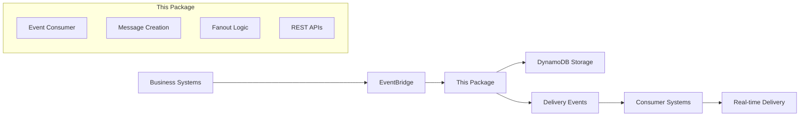
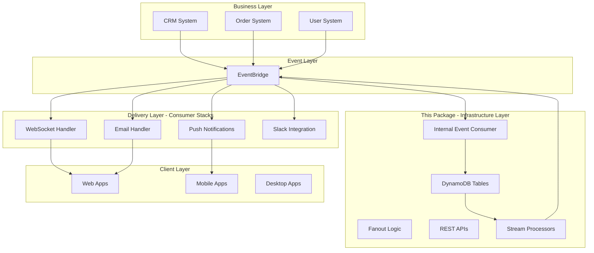
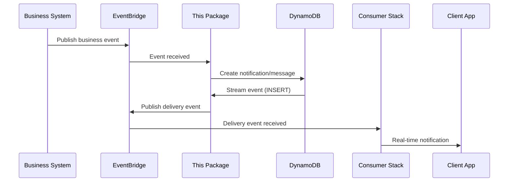
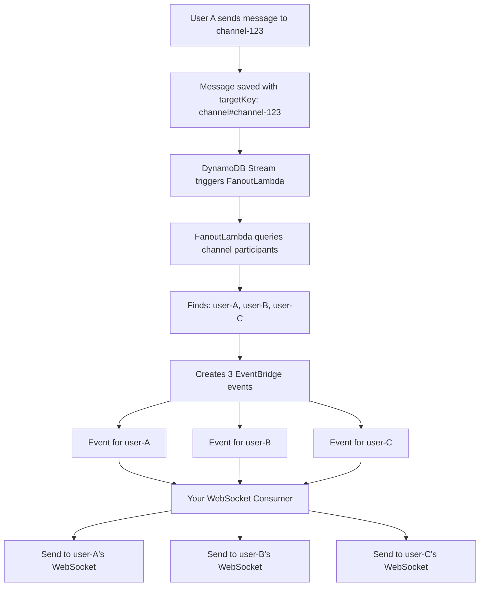

# @toldyaonce/kx-notifications-and-messaging-cdk

## What It Does

A **notification and messaging infrastructure package** that transforms business events into structured notifications and messages with intelligent multi-target delivery.

**Core Purpose:**
- 📥 **Consumes business events** from EventBridge (orders, leads, user actions, etc.)
- 🏗️ **Creates notifications/messages** automatically using configurable templates  
- 📊 **Stores with smart targeting** (user-specific, client-wide, broadcast)
- 📤 **Publishes delivery events** for real-time systems (WebSocket, push, email)
- 🔌 **Provides REST APIs** for CRUD operations

**Perfect for:**
- Multi-tenant applications needing targeted notifications
- Event-driven architectures requiring notification automation
- Systems needing both real-time and persistent messaging
- Applications with complex user/client hierarchies

## How It Works

### Event-Driven Architecture


### 1. Event Processing
Your business systems publish events:
```typescript
// CRM system publishes
{
  "source": "crm-system",
  "detail-type": "lead.created",
  "detail": { "leadId": "123", "clientId": "acme-corp", "leadName": "John Doe" }
}
```

### 2. Automatic Notification Creation
Package automatically creates notifications using templates:
```typescript
eventSubscriptions: [{
  eventPattern: { source: ['crm-system'], detailType: ['lead.created'] },
  notificationMapping: {
    'lead.created': {
      targetType: 'client',
      clientId: (detail) => detail.clientId,
      title: 'New Lead Created',
      content: (detail) => `Lead ${detail.leadName} needs attention`
    }
  }
}]
```

### 3. Smart Storage & Targeting
- **User notifications**: `targetKey: "user#user123"` - Personal notifications
- **Client notifications**: `targetKey: "client#acme-corp"` - Team-wide notifications
- **Broadcast notifications**: `targetKey: "broadcast"` - System-wide announcements

### 4. Delivery Event Publishing
Package publishes events for downstream delivery systems:
```typescript
{
  "source": "kx-notifications-messaging",
  "detail-type": "client.notification.available",
  "detail": { "userId": "user123", "notificationId": "notif-456", "priority": "high" }
}
```

## Architecture

### Complete System Architecture


### Data Flow


### Package Components
- **DynamoDB Tables**: Messages, notifications, and status tracking
- **EventBridge Integration**: Event consumption and publishing
- **Lambda Functions**: Event processing, fanout logic, API handlers
- **API Gateway**: REST endpoints for CRUD operations
- **Stream Processing**: Real-time event emission from data changes

## Integration Guide

### 🚀 Quick Start

```typescript
import { NotificationMessagingStack } from '@toldyaonce/kx-notifications-and-messaging-cdk';
import * as cdk from 'aws-cdk-lib';

const app = new cdk.App();

new NotificationMessagingStack(app, 'Notifications', {
  resourcePrefix: 'myapp',
  
  // Auto-create notifications from business events
  eventSubscriptions: [
    {
      name: 'OrderNotifications',
      eventPattern: { 
        source: ['order-system'], 
        detailType: ['order.shipped', 'order.delivered'] 
      },
      notificationMapping: {
        'order.shipped': {
          targetType: 'user',
          userId: (detail) => detail.customerId,
          title: 'Order Shipped',
          content: (detail) => `Order #${detail.orderId} is on its way!`,
          priority: 'medium'
        },
        'order.delivered': {
          targetType: 'user', 
          userId: (detail) => detail.customerId,
          title: 'Order Delivered',
          content: (detail) => `Order #${detail.orderId} has been delivered!`,
          priority: 'high'
        }
      }
    }
  ]
});
```

### 🔌 Bootstrap Guide: Integration with Existing API Gateway

This package needs to attach Lambda functions to your existing API Gateway. There are **two recommended approaches** depending on your stack architecture:

#### ✅ Approach 1: Same Stack Integration (Recommended)

Create the API Gateway and NotificationMessagingStack in the **same CDK stack**. This is the simplest and most reliable approach.

```typescript
import * as cdk from 'aws-cdk-lib';
import * as apigateway from 'aws-cdk-lib/aws-apigateway';
import { NotificationMessagingStack } from '@toldyaonce/kx-notifications-and-messaging-cdk';

export class MyAppStack extends cdk.Stack {
  constructor(scope: cdk.App, id: string, props?: cdk.StackProps) {
    super(scope, id, props);
    
    // 1. Create your API Gateway in this stack
    const api = new apigateway.RestApi(this, 'MainApi', {
      restApiName: 'my-app-api',
      deployOptions: { stageName: 'prod' },
      defaultCorsPreflightOptions: {
        allowOrigins: apigateway.Cors.ALL_ORIGINS,
        allowMethods: apigateway.Cors.ALL_METHODS,
      }
    });
    
    // 2. Add your existing services to the API
    // ... your other API resources ...
    
    // 3. Create NotificationMessagingStack as a nested stack OR use constructs
    // Option A: Use constructs directly (recommended)
    const messagingStack = new NotificationMessagingStack(this, 'Messaging', {
      resourcePrefix: 'myapp',
      apiGatewayConfig: {
        existingMessagesApi: api,           // ✅ Same stack - no cross-stack issues
        existingNotificationsApi: api,
        existingChannelsApi: api,
        separateApis: false,
        messagesBasePath: '/api/messages',
        notificationsBasePath: '/api/notifications',
        channelsBasePath: '/api/channels'
      },
      eventSubscriptions: [
        // Your event subscriptions
      ]
    });
    
    // 4. Output the API URL
    new cdk.CfnOutput(this, 'ApiUrl', {
      value: api.url,
      description: 'API Gateway URL'
    });
  }
}
```

**✅ Advantages:**
- No cross-stack reference issues
- Simpler deployment
- Permissions handled automatically
- Single `cdk deploy` command

---

#### ✅ Approach 2: Separate Stacks (Advanced)

If you need separate stacks (e.g., for independent deployment), you must deploy them in the **correct order** and use **stack references**.

```typescript
import * as cdk from 'aws-cdk-lib';
import * as apigateway from 'aws-cdk-lib/aws-apigateway';
import { NotificationMessagingStack } from '@toldyaonce/kx-notifications-and-messaging-cdk';

// Stack 1: Your main application stack with API Gateway
export class MainAppStack extends cdk.Stack {
  public readonly api: apigateway.RestApi;
  
  constructor(scope: cdk.App, id: string, props?: cdk.StackProps) {
    super(scope, id, props);
    
    // Create API Gateway
    this.api = new apigateway.RestApi(this, 'MainApi', {
      restApiName: 'my-app-api',
      deployOptions: { stageName: 'prod' }
    });
    
    // Your other resources...
  }
}

// Stack 2: Notifications/Messaging stack (depends on Stack 1)
export class MessagingStack extends NotificationMessagingStack {
  constructor(scope: cdk.App, id: string, mainStack: MainAppStack) {
    super(scope, id, {
      resourcePrefix: 'myapp',
      apiGatewayConfig: {
        existingMessagesApi: mainStack.api,      // ✅ Pass API from other stack
        existingNotificationsApi: mainStack.api,
        existingChannelsApi: mainStack.api,
        separateApis: false,
        messagesBasePath: '/api/messages',
        notificationsBasePath: '/api/notifications',
        channelsBasePath: '/api/channels'
      },
      eventSubscriptions: [
        // Your event subscriptions
      ]
    });
    
    // ⚠️ IMPORTANT: Add explicit dependency
    this.addDependency(mainStack);
  }
}

// App.ts - Deploy in correct order
const app = new cdk.App();

const mainStack = new MainAppStack(app, 'MainApp', {
  env: { account: '123456789012', region: 'us-east-1' }
});

const messagingStack = new MessagingStack(app, 'Messaging', mainStack);

app.synth();
```

**Deploy order:**
```bash
cdk deploy MainApp       # Deploy API Gateway first
cdk deploy Messaging     # Deploy messaging stack second
```

**⚠️ Important Notes:**
- Stacks must be in the **same AWS account and region**
- Use `addDependency()` to ensure correct deployment order
- API Gateway must exist before messaging stack deploys
- Package automatically handles cross-stack references safely

---

#### ❌ What NOT to Do

**Don't create sibling stacks without dependencies:**
```typescript
// ❌ BAD - This will cause cross-stack reference errors
const app = new cdk.App();

new cdk.Stack(app, 'ApiStack', { ... });              // Creates API
new NotificationMessagingStack(app, 'Messaging', {    // Tries to use API
  apiGatewayConfig: { existingMessagesApi: api }      // ❌ Cross-stack error!
});
```

**Don't forget to set the same account/region:**
```typescript
// ❌ BAD - Different accounts or regions will fail
new MainAppStack(app, 'Main', { 
  env: { account: '111111111111', region: 'us-east-1' } 
});
new MessagingStack(app, 'Messaging', mainStack, {
  env: { account: '222222222222', region: 'us-west-2' }  // ❌ Different env!
});
```

---

#### 🔧 Permission Handling

The package uses `LambdaIntegration` which **should** automatically grant API Gateway permission to invoke the Lambda functions. However, if you encounter 500 errors with no Lambda logs after deployment, you may need to manually grant permissions.

**Check if permissions exist:**
```bash
aws lambda get-policy --function-name <your-prefix>-messages-service
```

**If permissions are missing, grant them manually:**
```typescript
// In your consumer stack, after creating NotificationMessagingStack
import * as iam from 'aws-cdk-lib/aws-iam';

// Grant permissions for each service Lambda
const messagingLambda = lambda.Function.fromFunctionName(
  this, 
  'MessagesLambda', 
  'myapp-messages-service'
);

messagingLambda.grantInvoke(
  new iam.ServicePrincipal('apigateway.amazonaws.com')
);

// Repeat for notifications and channels Lambdas
```

**Or use AWS CLI after deployment:**
```bash
aws lambda add-permission \
  --function-name myapp-messages-service \
  --statement-id apigateway-invoke \
  --action lambda:InvokeFunction \
  --principal apigateway.amazonaws.com \
  --source-arn "arn:aws:execute-api:<region>:<account>:<api-id>/*/*/*"
```

---

#### 🐛 Troubleshooting Bootstrap Issues

##### Issue: "Cross stack references are only supported for stacks deployed to the same account"

**Cause:** Stacks are in different accounts or regions, or are sibling stacks without dependencies.

**Fix:** 
1. Ensure both stacks have the same `env` (account + region)
2. Add explicit dependency: `messagingStack.addDependency(mainStack)`
3. Or use Approach 1 (same stack)

##### Issue: API returns 500, Lambda has no logs

**Cause:** API Gateway permission to invoke Lambda wasn't granted by `LambdaIntegration`.

**Diagnosis:**
```bash
# Check if Lambda exists
aws lambda get-function --function-name <your-prefix>-messages-service

# Check if permissions exist
aws lambda get-policy --function-name <your-prefix>-messages-service
```

**Fix Option 1 - AWS CLI (quickest):**
```bash
aws lambda add-permission \
  --function-name <your-prefix>-messages-service \
  --statement-id apigateway-invoke \
  --action lambda:InvokeFunction \
  --principal apigateway.amazonaws.com \
  --source-arn "arn:aws:execute-api:<region>:<account>:<api-id>/*/*/*"

# Repeat for notifications and channels services
aws lambda add-permission --function-name <your-prefix>-notifications-service --statement-id apigateway-invoke --action lambda:InvokeFunction --principal apigateway.amazonaws.com --source-arn "arn:aws:execute-api:<region>:<account>:<api-id>/*/*/*"

aws lambda add-permission --function-name <your-prefix>-channels-service --statement-id apigateway-invoke --action lambda:InvokeFunction --principal apigateway.amazonaws.com --source-arn "arn:aws:execute-api:<region>:<account>:<api-id>/*/*/*"
```

**Fix Option 2 - CDK (permanent):**

Add this to your consumer stack AFTER the NotificationMessagingStack:
```typescript
import * as lambda from 'aws-cdk-lib/aws-lambda';
import * as iam from 'aws-cdk-lib/aws-iam';

// After creating messaging stack and API
const messagesLambda = lambda.Function.fromFunctionName(
  this, 'MessagesLambda', 'myapp-messages-service'
);
messagesLambda.addPermission('ApiGatewayInvoke', {
  principal: new iam.ServicePrincipal('apigateway.amazonaws.com'),
  sourceArn: api.arnForExecuteApi()
});

// Repeat for other Lambdas...
```

Then redeploy: `cdk deploy`

##### Issue: "Resource already exists" during deployment

**Cause:** API Gateway resource path conflicts with existing resources.

**Fix:** Change the base paths:
```typescript
apiGatewayConfig: {
  messagesBasePath: '/v1/messages',        // Use different path
  notificationsBasePath: '/v1/notifications',
  channelsBasePath: '/v1/channels'
}
```

---

#### 📝 Complete Working Example

```typescript
// app.ts
import * as cdk from 'aws-cdk-lib';
import * as apigateway from 'aws-cdk-lib/aws-apigateway';
import { NotificationMessagingStack } from '@toldyaonce/kx-notifications-and-messaging-cdk';

const app = new cdk.App();

// Single stack approach (recommended)
class MyCompleteStack extends cdk.Stack {
  constructor(scope: cdk.App, id: string) {
    super(scope, id, {
      env: {
        account: process.env.CDK_DEFAULT_ACCOUNT,
        region: process.env.CDK_DEFAULT_REGION
      }
    });
    
    // API Gateway
    const api = new apigateway.RestApi(this, 'Api', {
      restApiName: 'my-app-api',
      deployOptions: { stageName: 'prod' }
    });
    
    // Your services
    const helloResource = api.root.addResource('hello');
    helloResource.addMethod('GET');
    
    // Messaging infrastructure
    new NotificationMessagingStack(this, 'Messaging', {
      resourcePrefix: 'myapp',
      apiGatewayConfig: {
        existingMessagesApi: api,
        existingNotificationsApi: api,
        separateApis: false,
        messagesBasePath: '/api/messages',
        notificationsBasePath: '/api/notifications',
        channelsBasePath: '/api/channels'
      },
      eventSubscriptions: [
        {
          name: 'OrderNotifications',
          eventPattern: {
            source: ['order-service'],
            detailType: ['order.created']
          },
          notificationMapping: {
            'order.created': {
              targetType: 'user',
              userId: (detail) => detail.customerId,
              title: 'New Order',
              content: (detail) => `Order #${detail.orderId} created!`,
              priority: 'high'
            }
          }
        }
      ]
    });
    
    new cdk.CfnOutput(this, 'ApiEndpoint', {
      value: api.url
    });
  }
}

new MyCompleteStack(app, 'MyApp');
app.synth();
```

Deploy:
```bash
cdk deploy
```

**Result:** All services available at:
- `https://<api-id>.execute-api.<region>.amazonaws.com/prod/hello` (your service)
- `https://<api-id>.execute-api.<region>.amazonaws.com/prod/api/messages` (package)
- `https://<api-id>.execute-api.<region>.amazonaws.com/prod/api/notifications` (package)
- `https://<api-id>.execute-api.<region>.amazonaws.com/prod/api/channels` (package)

✅ **All services on one API Gateway, one deployment, no cross-stack issues!**

### 🌐 Consumer Stack Integration (Real-time Delivery)

```typescript
// Consumer stack handles real-time delivery
export class NotificationConsumerStack extends cdk.Stack {
  constructor(scope: cdk.App, id: string, notificationStack: NotificationMessagingStack) {
    super(scope, id);
    
    // WebSocket API Gateway for real-time delivery
    const webSocketApi = new apigatewayv2.WebSocketApi(this, 'ChatWebSocket', {
      // ... WebSocket configuration
    });
    
    // WebSocket handler for real-time delivery
    const websocketHandler = new lambda.Function(this, 'WebSocketHandler', {
      runtime: lambda.Runtime.NODEJS_18_X,
      handler: 'index.handler',
      code: lambda.Code.fromInline(`
        const { ApiGatewayManagementApiClient, PostToConnectionCommand } = require('@aws-sdk/client-apigatewaymanagementapi');
        
        exports.handler = async (event) => {
          const { userId, notificationId, messageId } = event.detail;
          
          // Get user's WebSocket connection
          const connectionId = await getUserConnection(userId);
          
          if (connectionId) {
            const apiGw = new ApiGatewayManagementApiClient({
              endpoint: process.env.WEBSOCKET_ENDPOINT
            });
            
            await apiGw.send(new PostToConnectionCommand({
              ConnectionId: connectionId,
              Data: JSON.stringify({
                type: 'notification',
                notificationId,
                messageId,
                timestamp: new Date().toISOString()
              })
            }));
          }
        };
      `),
      environment: {
        WEBSOCKET_ENDPOINT: webSocketApi.apiEndpoint
      }
    });
    
    // Listen to notification events from the package
    new events.Rule(this, 'NotificationRule', {
      eventBus: notificationStack.eventBridge.eventBus,
      eventPattern: {
        source: ['kx-notifications-messaging'],
        detailType: [
          'notification.created',
          'message.created', 
          'client.notification.available',
          'client.message.available'
        ]
      },
      targets: [new targets.LambdaFunction(websocketHandler)]
    });
  }
}
```

### 📱 Multi-Target Notification Examples

```typescript
eventSubscriptions: [
  {
    name: 'UserNotifications',
    eventPattern: { source: ['user-system'], detailType: ['profile.updated'] },
    notificationMapping: {
      'profile.updated': {
        targetType: 'user',                    // Personal notification
        userId: (detail) => detail.userId,
        title: 'Profile Updated',
        content: 'Your profile has been successfully updated'
      }
    }
  },
  {
    name: 'TeamNotifications', 
    eventPattern: { source: ['project-system'], detailType: ['project.completed'] },
    notificationMapping: {
      'project.completed': {
        targetType: 'client',                  // Team-wide notification
        clientId: (detail) => detail.tenantId,
        title: 'Project Completed',
        content: (detail) => `Project ${detail.projectName} has been completed!`,
        priority: 'high'
      }
    }
  },
  {
    name: 'SystemNotifications',
    eventPattern: { source: ['system'], detailType: ['maintenance.scheduled'] },
    notificationMapping: {
      'maintenance.scheduled': {
        targetType: 'broadcast',               // System-wide notification
        title: 'Scheduled Maintenance',
        content: (detail) => `System maintenance scheduled for ${detail.scheduledTime}`,
        priority: 'urgent'
      }
    }
  }
]
```

## 💬 Chat Channels & Lead Management

### Overview

The package includes comprehensive chat channels functionality for lead management and real-time messaging. This enables:

- **Lead Capture**: Automatic channel creation when visitors start chat
- **Bot Assignment**: Random employee bot personalities engage new leads  
- **Lead Claiming**: Employees can claim leads from bots
- **Real-time Chat**: WebSocket delivery via EventBridge integration
- **Multi-tenant Security**: Proper isolation and permissions

### Architecture

```mermaid
graph TB
    subgraph "Lead Flow"
        A1[Website Visitor] --> A2[Starts Chat]
        A2 --> A3[Create Channel API]
        A3 --> A4[Assign Random Bot]
        A4 --> A5[Bot Engages Lead]
    end
    
    subgraph "Employee Flow"  
        B1[Employee Login] --> B2[List Channels API]
        B2 --> B3[See Unclaimed Leads]
        B3 --> B4[Claim Lead API]
        B4 --> B5[Bot Leaves, Employee Takes Over]
    end
    
    subgraph "Real-time Messaging"
        C1[Send Message API] --> C2[Store in DynamoDB]
        C2 --> C3[EventBridge Event]
        C3 --> C4[WebSocket Broadcast]
        C4 --> C5[All Channel Participants]
    end
```



### Database Schema

#### Channels Table
```typescript
interface Channel {
  channelId: string;          // Primary key
  createdAt: string;          // Sort key  
  channelType: 'lead' | 'group' | 'direct';
  tenantId: string;           // Tenant isolation
  title?: string;             // Optional channel name
  isActive?: boolean;         // Whether channel is active (not archived)
  
  // Lead-specific fields
  leadStatus?: 'unclaimed' | 'claimed';
  claimedBy?: string;         // Employee who claimed
  botEmployeeId?: string;     // Employee whose bot personality is used
  
  // Metadata
  participants: string[];     // Array of userIds
  participantHash?: string;   // Deterministic hash for finding exact matches (e.g., "user1|user2|user3")
  lastActivity: string;       // ISO timestamp
  lastMessage?: {
    content: string;
    senderId: string;
    timestamp: string;
    messageId: string;
  };
}
```

**GSIs:**
- `tenantId-lastActivity-index` - Query channels by tenant, sorted by activity
- `tenantId-leadStatus-index` - Query unclaimed leads by tenant
- `channelId-index` - Query channel by ID without knowing createdAt
- `participantHash-index` - **NEW** - Find channels by exact participant match

#### Channel Participants Table  
```typescript
interface ChannelParticipant {
  userId: string;             // Primary key (employees, bots, leads)
  channelId: string;          // Sort key
  tenantId: string;           // For tenant-based queries
  role: 'employee' | 'bot' | 'lead' | 'admin';
  joinedAt: string;           // ISO timestamp
  leftAt?: string;            // When user left (if applicable)
  isActive: boolean;          // Current participation status
}
```

### Integration Steps

#### 1. 🏗️ Deploy with Chat Channels

```typescript
import { NotificationMessagingStack } from '@toldyaonce/kx-notifications-and-messaging-cdk';

const messagingStack = new NotificationMessagingStack(this, 'Messaging', {
  resourcePrefix: 'myapp',
  
  // EventBridge subscriptions for real-time chat
  eventSubscriptions: [
    {
      name: 'ChatMessageDelivery',
      eventPattern: {
        source: ['kx-notifications-messaging'],
        'detail-type': ['chat.message.sent']
      },
      targets: [{
        id: 'WebSocketBroadcast',
        arn: 'arn:aws:lambda:region:account:function:websocket-handler'
      }]
    },
    {
      name: 'NewLeadAlert', 
      eventPattern: {
        source: ['kx-notifications-messaging'],
        'detail-type': ['channel.created'],
        detail: { channelType: ['lead'], leadStatus: ['unclaimed'] }
      },
      targets: [{
        id: 'NotifyEmployees',
        arn: 'arn:aws:lambda:region:account:function:notify-new-lead'
      }]
    }
  ]
});

// Access the new APIs
const channelsApi = messagingStack.channelsApi;
const channelsTable = messagingStack.dynamoTables.channelsTable;
const participantsTable = messagingStack.dynamoTables.channelParticipantsTable;
```

#### 2. 🤖 Channel Creation Examples

**Create Direct Message Channel:**
```typescript
const createDirectChannel = async (user1Id: string, user1Name: string, user2Id: string, user2Name: string) => {
  const response = await fetch(`${channelsApiUrl}/channels`, {
    method: 'POST',
    headers: {
      'Content-Type': 'application/json',
      'Authorization': `Bearer ${userToken}`
    },
    body: JSON.stringify({
      channelType: 'direct',
      participants: [
        { userId: user1Id, userName: user1Name },
        { userId: user2Id, userName: user2Name }
      ]
    })
  });
  
  const { channel } = await response.json();
  return channel.channelId;
};
```

**Create Lead Channel (Website Integration):**
```typescript
// When visitor starts chat on your website
const createLeadChannel = async (visitorId: string, visitorName: string, employeeId: string) => {
  const response = await fetch(`${channelsApiUrl}/channels`, {
    method: 'POST',
    headers: {
      'Content-Type': 'application/json',
      'Authorization': `Bearer ${systemToken}` // Service account token
    },
    body: JSON.stringify({
      channelType: 'lead',
      title: 'New Website Visitor',
      participants: [
        { userId: visitorId, userName: visitorName || 'Anonymous Visitor' }
      ],
      botEmployeeId: employeeId,  // Random employee for bot personality
      metadata: {
        visitorInfo: {
          page: window.location.pathname,
          referrer: document.referrer,
          userAgent: navigator.userAgent
        }
      }
    })
  });
  
  const { channel } = await response.json();
  return channel.channelId;
};
```

#### 3. 💬 Send Chat Messages

```typescript
// Send message in channel (works for bots, employees, leads)
const sendChatMessage = async (channelId: string, content: string, senderId: string) => {
  const response = await fetch(`${messagesApiUrl}/messages`, {
    method: 'POST',
    headers: {
      'Content-Type': 'application/json',
      'Authorization': `Bearer ${userToken}`
    },
    body: JSON.stringify({
      targetType: 'channel',
      channelId,
      messageType: 'chat',
      content,
      senderId,
      // Optional: threading
      replyToMessageId: parentMessageId
    })
  });
  
  return await response.json();
};
```

#### 4. 👥 Employee Channel Management

```typescript
// Get channels for employee (their channels + unclaimed leads from tenant)
const getEmployeeChannels = async (employeeToken: string) => {
  const response = await fetch(`${channelsApiUrl}/channels?limit=50`, {
    headers: {
      'Authorization': `Bearer ${employeeToken}`
    }
  });
  
  const { channels } = await response.json();
  
  // Channels are automatically filtered:
  // - Employee's active channels
  // - Unclaimed leads from their tenant (for claiming)
  return channels;
};

// Claim a lead (employee takes over from bot)
const claimLead = async (channelId: string, employeeToken: string) => {
  const response = await fetch(`${channelsApiUrl}/channels/${channelId}/claim`, {
    method: 'POST',
    headers: {
      'Authorization': `Bearer ${employeeToken}`
    }
  });
  
  // Bot automatically stops engaging, employee takes over
  return await response.json();
};
```

#### 5. 📱 WebSocket Consumer Implementation

**Important:** Channel messages are automatically fanned out to individual users. Your consumer doesn't need to query channels - just listen for user-specific events!

##### How Channel Message Fanout Works



**Key Insight:** The package automatically converts channel-targeted messages into user-specific events. You just need to listen for `chat.message.available` events filtered by `userId`.

##### Consumer Stack Setup

```typescript
import * as cdk from 'aws-cdk-lib';
import * as events from 'aws-cdk-lib/aws-events';
import * as targets from 'aws-cdk-lib/aws-events-targets';
import * as lambda from 'aws-cdk-lib/aws-lambda';
import * as apigatewayv2 from '@aws-cdk/aws-apigatewayv2-alpha';
import { NotificationMessagingStack } from '@toldyaonce/kx-notifications-and-messaging-cdk';

export class WebSocketConsumerStack extends cdk.Stack {
  constructor(scope: cdk.App, id: string, messagingStack: NotificationMessagingStack) {
    super(scope, id);
    
    // 1. Create WebSocket API
    const webSocketApi = new apigatewayv2.WebSocketApi(this, 'ChatWebSocket', {
      routeSelectionExpression: '$request.body.action',
    });
    
    const stage = new apigatewayv2.WebSocketStage(this, 'Production', {
      webSocketApi,
      stageName: 'prod',
      autoDeploy: true,
    });
    
    // 2. Create WebSocket message sender Lambda
    const websocketSenderLambda = new lambda.Function(this, 'WebSocketSender', {
      runtime: lambda.Runtime.NODEJS_18_X,
      handler: 'index.handler',
      code: lambda.Code.fromAsset('./lambda/websocket-sender'),
      environment: {
        WEBSOCKET_API_ENDPOINT: stage.url,
        CONNECTIONS_TABLE: connectionsTable.tableName,
        MESSAGES_TABLE: messagingStack.dynamoTables.messagesTable.tableName
      },
      timeout: cdk.Duration.seconds(30)
    });
    
    // Grant permissions
    webSocketApi.grantManageConnections(websocketSenderLambda);
    connectionsTable.grantReadWriteData(websocketSenderLambda);
    messagingStack.dynamoTables.messagesTable.grantReadData(websocketSenderLambda);
    
    // 3. Create EventBridge rule to listen for channel messages
    new events.Rule(this, 'ChatMessageRule', {
      eventBus: messagingStack.eventBridge.eventBus,
      eventPattern: {
        source: ['kx-notifications-messaging'],
        detailType: ['chat.message.available']  // Already fanned out per user!
      },
      targets: [new targets.LambdaFunction(websocketSenderLambda)]
    });
  }
}
```

##### WebSocket Sender Lambda Implementation

```typescript
// lambda/websocket-sender/index.ts
import { EventBridgeEvent } from 'aws-lambda';
import { ApiGatewayManagementApiClient, PostToConnectionCommand, GoneException } from '@aws-sdk/client-apigatewaymanagementapi';
import { DynamoDBClient } from '@aws-sdk/client-dynamodb';
import { DynamoDBDocumentClient, GetCommand, DeleteCommand } from '@aws-sdk/lib-dynamodb';

const dynamodb = DynamoDBDocumentClient.from(new DynamoDBClient({}));
const apiGateway = new ApiGatewayManagementApiClient({
  endpoint: process.env.WEBSOCKET_API_ENDPOINT
});

interface ChatMessageEvent {
  eventId: string;
  eventType: 'chat.message.available';
  userId: string;          // The user who should receive this message
  channelId: string;       // The channel the message was sent to
  messageId: string;       // The message ID
  targetType: 'channel';
  tenantId?: string;       // The tenant ID from the message
  timestamp: string;
  priority?: string;
  content?: string;        // May be included for optimization
  senderId?: string;       // May be included for optimization
  metadata: {
    fanoutSource: 'channel-targeting';
    originalTargetKey: string;
  };
}

export const handler = async (event: EventBridgeEvent<string, ChatMessageEvent>) => {
  console.log('Received chat message event:', JSON.stringify(event, null, 2));
  
  const { detail } = event;
  const { userId, channelId, messageId, content, senderId } = detail;
  
  try {
    // 1. Get user's WebSocket connectionId
    const connectionResult = await dynamodb.send(new GetCommand({
      TableName: process.env.CONNECTIONS_TABLE!,
      Key: { userId }
    }));
    
    if (!connectionResult.Item?.connectionId) {
      console.log(`No active WebSocket connection for user ${userId}`);
      return; // User not connected, skip (message is still in DB)
    }
    
    const connectionId = connectionResult.Item.connectionId;
    
    // 2. Get full message details (if not in event)
    let messageData;
    if (content) {
      // Content already included (optimization)
      messageData = {
        messageId,
        channelId,
        content,
        senderId,
        timestamp: detail.timestamp
      };
    } else {
      // Fetch from DynamoDB
      const messageResult = await dynamodb.send(new GetCommand({
        TableName: process.env.MESSAGES_TABLE!,
        Key: { messageId }
      }));
      messageData = messageResult.Item;
    }
    
    // 3. Send to WebSocket
    await apiGateway.send(new PostToConnectionCommand({
      ConnectionId: connectionId,
      Data: Buffer.from(JSON.stringify({
        type: 'chat.message',
        channelId,
        messageId,
        message: messageData.content,
        senderId: messageData.senderId,
        senderName: messageData.metadata?.userName,
        timestamp: messageData.timestamp || messageData.createdAt,
        metadata: messageData.metadata
      }))
    }));
    
    console.log(`✅ Sent message ${messageId} to user ${userId} via connection ${connectionId}`);
    
  } catch (error) {
    if (error instanceof GoneException) {
      // Connection no longer exists - clean up
      console.log(`Connection gone for user ${userId}, cleaning up...`);
      await dynamodb.send(new DeleteCommand({
        TableName: process.env.CONNECTIONS_TABLE!,
        Key: { userId }
      }));
    } else {
      console.error('Error sending message:', error);
      throw error; // Trigger retry
    }
  }
};
```

##### WebSocket Connection Management

You need a DynamoDB table to track active WebSocket connections:

```typescript
// In your consumer stack
const connectionsTable = new dynamodb.Table(this, 'WebSocketConnections', {
  tableName: 'websocket-connections',
  partitionKey: { name: 'userId', type: dynamodb.AttributeType.STRING },
  billingMode: dynamodb.BillingMode.PAY_PER_REQUEST,
  timeToLiveAttribute: 'ttl', // Auto-cleanup stale connections
  removalPolicy: cdk.RemovalPolicy.DESTROY
});
```

**Connection Handler (when user connects):**
```typescript
// On WebSocket $connect
export const connectHandler = async (event: any) => {
  const connectionId = event.requestContext.connectionId;
  const userId = getUserIdFromAuth(event); // Extract from JWT/auth context
  
  await dynamodb.send(new PutCommand({
    TableName: process.env.CONNECTIONS_TABLE!,
    Item: {
      userId,
      connectionId,
      connectedAt: new Date().toISOString(),
      ttl: Math.floor(Date.now() / 1000) + 86400 // 24 hours
    }
  }));
  
  return { statusCode: 200 };
};
```

**Disconnect Handler (when user disconnects):**
```typescript
// On WebSocket $disconnect
export const disconnectHandler = async (event: any) => {
  const connectionId = event.requestContext.connectionId;
  
  // Find and delete the connection
  // Option 1: If you store connectionId as secondary index
  await dynamodb.send(new DeleteCommand({
    TableName: process.env.CONNECTIONS_TABLE!,
    Key: { userId: getUserIdFromConnection(connectionId) }
  }));
  
  return { statusCode: 200 };
};
```

##### What You DON'T Need to Do

❌ **Don't query channel participants** - The FanoutLambda already did this  
❌ **Don't broadcast to all connections** - Each event is user-specific  
❌ **Don't filter by channelId** - Filter by userId instead  
❌ **Don't query which channels a user belongs to** - Events already targeted  

##### What You DO Need to Do

✅ **Listen for `chat.message.available` events** from EventBridge  
✅ **Extract `userId` from event** - Each event is for one user  
✅ **Look up WebSocket connectionId** for that userId  
✅ **Send message to that connection** - One user at a time  
✅ **Handle disconnections gracefully** - Clean up stale connections  

##### Testing Your Implementation

1. **Setup:** Two users connect to WebSocket
   ```javascript
   // User A connects
   const wsA = new WebSocket('wss://your-websocket-api.execute-api.region.amazonaws.com/prod');
   
   // User B connects  
   const wsB = new WebSocket('wss://your-websocket-api.execute-api.region.amazonaws.com/prod');
   ```

2. **User A sends message:**
   ```javascript
   await fetch(`${apiUrl}/messages`, {
     method: 'POST',
     headers: { 'Authorization': `Bearer ${tokenA}` },
     body: JSON.stringify({
       targetType: 'channel',
       channelId: 'channel-123',
       content: 'Hello everyone!',
       senderId: 'user-a'
     })
   });
   ```

3. **What happens:**
   - Message saved with `targetKey: "channel#channel-123"`
   - FanoutLambda queries participants: `["user-a", "user-b"]`
   - Two EventBridge events created:
     - `{ userId: "user-a", channelId: "channel-123", messageId: "msg-456" }`
     - `{ userId: "user-b", channelId: "channel-123", messageId: "msg-456" }`
   - Your consumer Lambda triggered twice (once per user)
   - Both WebSockets receive the message

4. **User B receives:**
   ```javascript
   wsB.onmessage = (event) => {
     const data = JSON.parse(event.data);
     // data = {
     //   type: 'chat.message',
     //   channelId: 'channel-123',
     //   messageId: 'msg-456',
     //   message: 'Hello everyone!',
     //   senderId: 'user-a',
     //   timestamp: '2025-10-30T...'
     // }
   };
   ```

##### Complete Working Example

See the full working example in the repository:
- Consumer Stack: `examples/websocket-consumer-stack.ts`
- Lambda Handler: `examples/websocket-sender-lambda.ts`
- Frontend Integration: `examples/websocket-client.ts`

##### Additional Event Types

Listen for other channel events:

```typescript
new events.Rule(this, 'AllChannelEvents', {
  eventBus: messagingStack.eventBridge.eventBus,
  eventPattern: {
    source: ['kx-notifications-messaging'],
    detailType: [
      'chat.message.available',    // Channel messages (fanned out)
      'channel.created',            // New channel created
      'channel.claimed',            // Lead claimed by employee
      'channel.deleted',            // Channel deleted
      'user.joined.channel',        // User joined channel
      'user.left.channel'          // User left channel
    ]
  },
  targets: [new targets.LambdaFunction(websocketSenderLambda)]
});
```

### Chat API Reference

#### Channels API

| Method | Endpoint | Description | Query Parameters | Auth Required |
|--------|----------|-------------|------------------|---------------|
| `GET` | `/channels` | List user's channels + unclaimed leads | `userId`, `tenantId`, `includeAnonymous`, `limit` | Employee Token |
| `POST` | `/channels` | Create new channel | - | System/Employee Token |
| `POST` | `/channels/find` | Find channels by exact participants | Body: `{ userIds: string[] }` | Employee Token |
| `GET` | `/channels/{id}` | Get channel details with messages | - | Participant Token |
| `PUT` | `/channels/{id}` | Update channel metadata | - | Admin/Owner Token |
| `DELETE` | `/channels/{id}` | Leave channel (default) or permanently delete (admin + `?forceDelete=true`) | `forceDelete` (optional, admin only) | Participant Token |
| `DELETE` | `/channels` | Leave multiple channels (default) or bulk delete (admin + `?forceDelete=true`) | `channelIds` (comma-separated), `forceDelete` (optional, admin only) | Participant Token |
| `POST` | `/channels/{id}/join` | Join channel | - | Employee Token |
| `POST` | `/channels/{id}/leave` | Leave channel (same as DELETE without forceDelete) | - | Participant Token |
| `POST` | `/channels/{id}/claim` | Claim lead channel | - | Employee Token |
| `POST` | `/channels/{id}/assign-bot` | Assign bot to channel | - | System Token |

**GET /channels Query Parameters:**
- `userId` - Filter channels by participant userId (defaults to authenticated user)
- `tenantId` - Required for tenant isolation (from auth context)
- `includeAnonymous` - Include unclaimed lead channels (default: `true`, set to `false` to exclude)
- `limit` - Max number of channels to return (default: `50`)

**Examples:**
```bash
# Get all channels for authenticated user (includes unclaimed leads)
GET /channels

# Get specific user's channels with unclaimed leads
GET /channels?userId=user-123

# Get only user's channels (exclude unclaimed leads)
GET /channels?userId=user-123&includeAnonymous=false

# Get first 10 channels
GET /channels?limit=10
```

**GET /channels Response (Enriched with Participant Details):**
```json
{
  "success": true,
  "channels": [
    {
      "channelId": "abc-123",
      "channelType": "direct",
      "participants": ["user-1", "user-2"],
      "participantDetails": [
        {
          "userId": "user-1",
          "userName": "John Doe",
          "role": "employee",
          "joinedAt": "2025-10-19T..."
        },
        {
          "userId": "user-2",
          "userName": "Jane Smith",
          "role": "employee",
          "joinedAt": "2025-10-19T..."
        }
      ],
      "lastActivity": "2025-10-19T...",
      "createdAt": "2025-10-19T...",
      "tenantId": "tenant_xyz"
    }
  ],
  "count": 1,
  "queryParams": {
    "userId": "user-1",
    "tenantId": "tenant_xyz",
    "includeAnonymous": true
  }
}
```

**POST /channels/find - Find Channels by Exact Participants:**

This endpoint helps prevent duplicate channels by finding existing channels with the **exact same set of participants**. Use this before creating a new channel to avoid creating duplicate group chats.

```bash
# Find channels where participants are EXACTLY user-1, user-2, and user-3
POST /channels/find
Content-Type: application/json
Authorization: Bearer {token}

{
  "userIds": ["user-1", "user-2", "user-3"]
}
```

**Response:**
```json
{
  "success": true,
  "channels": [
    {
      "channelId": "existing-channel-123",
      "participants": ["user-1", "user-2", "user-3"],
      "participantHash": "user-1|user-2|user-3",
      "channelType": "group",
      "createdAt": "2025-10-19T...",
      "tenantId": "tenant_xyz"
    }
  ],
  "participantHash": "user-1|user-2|user-3",
  "matchCount": 1
}
```

**Use Case - Preventing Duplicate Channels:**
```typescript
// Before creating a new channel, check if one already exists
async function getOrCreateChannel(participantIds: string[]) {
  // 1. Try to find existing channel with these exact participants
  const findResponse = await fetch('/api/channels/find', {
    method: 'POST',
    body: JSON.stringify({ userIds: participantIds }),
    headers: { 'Content-Type': 'application/json' }
  });
  
  const { channels } = await findResponse.json();
  
  // 2. If found, use existing channel
  if (channels && channels.length > 0) {
    console.log('✅ Using existing channel:', channels[0].channelId);
    return channels[0];
  }
  
  // 3. Otherwise, create new channel
  const createResponse = await fetch('/api/channels', {
    method: 'POST',
    body: JSON.stringify({
      participants: participantIds.map(id => ({ userId: id })),
      channelType: 'group'
    }),
    headers: { 'Content-Type': 'application/json' }
  });
  
  const { channel } = await createResponse.json();
  console.log('✨ Created new channel:', channel.channelId);
  return channel;
}
```

**How It Works:**
- The system computes a deterministic hash from **sorted participant IDs** (e.g., `"user-1|user-2|user-3"`)
- This hash is stored on the channel as `participantHash`
- The `find` endpoint queries by this hash for O(1) lookups
- The hash is automatically updated when participants join/leave
- Only returns **active** channels (not archived)

**Note:** The order of `userIds` in the request doesn't matter - the system automatically sorts them for matching.
```

**GET /channels/{id} Response (with Last 50 Messages):**
```json
{
  "success": true,
  "channel": {
    "channelId": "abc-123",
    "channelType": "direct",
    "participants": ["user-1", "user-2"],
    "lastActivity": "2025-10-19T...",
    "createdAt": "2025-10-19T..."
  },
  "messages": [
    {
      "messageId": "msg-1",
      "senderId": "user-1",
      "content": "Hello!",
      "dateReceived": "2025-10-19T..."
    }
  ],
  "messageCount": 1,
  "hasMore": false
}
```

**Note:** `participantDetails` array includes active participants with their names, roles, and join times. No need for additional lookups!

**POST /channels - Create Channel:**
```typescript
{
  channelType: 'direct' | 'group' | 'lead',
  title?: string,
  participants: Array<{           // Array of participant objects
    userId: string,
    userName?: string
  }>,
  botEmployeeId?: string,         // For lead channels with bot assignment
  metadata?: {
    createdBy?: string,
    createdAt?: string,
    // ... custom fields
  }
}
```

**Example Request:**
```json
{
  "channelType": "direct",
  "participants": [
    { "userId": "user-123", "userName": "John Doe" },
    { "userId": "user-456", "userName": "Jane Smith" }
  ],
  "metadata": {
    "createdBy": "user-123"
  }
}
```

**Response:**
```json
{
  "success": true,
  "channel": {
    "channelId": "uuid",
    "channelType": "direct",
    "participants": ["user-1", "user-2"],
    "tenantId": "tenant_xyz",
    "createdAt": "2025-10-19T...",
    "lastActivity": "2025-10-19T..."
  },
  "message": "Channel created successfully"
}
```

**POST /channels/{channelId}/join:**
```bash
POST /channels/abc-123/join

# Optional body to include userName
{
  "userName": "John Doe"
}
```

**POST /channels/{channelId}/claim:**
```bash
POST /channels/abc-123/claim

# Optional body to include userName
{
  "userName": "Jane Smith"
}
```

**Response:**
```json
{
  "success": true,
  "message": "Lead claimed successfully"
}
```

**POST /channels/{channelId}/assign-bot:**
```bash
POST /channels/abc-123/assign-bot

# Body required
{
  "botEmployeeId": "employee-789",
  "botName": "Support Bot" // Optional display name
}
```

**DELETE /channels - Leave or Permanently Delete Channels:**

The delete endpoint has **two behaviors** depending on user role and flags:

1. **Default (Regular Users & Admins)**: Removes user as participant (leaves channel) - **channel and messages preserved for other participants**
2. **Admin with `?forceDelete=true`**: Permanently deletes channel, all messages, and all participants - **DESTRUCTIVE**

This design ensures users don't accidentally destroy conversations for other participants.

---

**Regular User - Leave Single Channel:**
```bash
# Removes you as a participant, preserves channel for others
DELETE /channels/abc-123
Authorization: Bearer {token}
```

**Regular User - Leave Multiple Channels:**
```bash
# Removes you from all specified channels
DELETE /channels?channelIds=abc-123,def-456,ghi-789
Authorization: Bearer {token}
```

**Response (Leave Channels):**
```json
{
  "success": true,
  "message": "Left 3 of 3 channel(s)",
  "results": {
    "success": [
      { "channelId": "abc-123" },
      { "channelId": "def-456" },
      { "channelId": "ghi-789" }
    ],
    "failed": []
  },
  "summary": {
    "channelsLeft": 3
  }
}
```

---

**Admin - Permanent Deletion (DESTRUCTIVE):**

⚠️ **WARNING**: This permanently deletes channels, messages, and participants for ALL users. Use with caution.

```bash
# Admin permanently destroys channel and all data
DELETE /channels/abc-123?forceDelete=true
Authorization: Bearer {adminToken}

# Admin bulk permanent deletion
DELETE /channels?channelIds=abc-123,def-456&forceDelete=true
Authorization: Bearer {adminToken}
```

**Response (Permanent Deletion):**
```json
{
  "success": true,
  "message": "Deleted 2 of 2 channel(s)",
  "results": {
    "success": [
      { "channelId": "abc-123" },
      { "channelId": "def-456" }
    ],
    "failed": []
  },
  "summary": {
    "channelsDeleted": 2,
    "messagesDeleted": 45,
    "participantsDeleted": 12
  }
}
```

---

**Permission Requirements:**

| Operation | Permission Required | Query Flag |
|-----------|-------------------|------------|
| Leave Channel | Participant (yourself) | None (default) |
| Permanent Delete | Admin only | `?forceDelete=true` |

**What Happens - Leave Channel (Default):**
1. User marked as inactive participant (`isActive = false`)
2. `leftAt` timestamp recorded
3. Channel `participantHash` updated
4. Publishes `user.left.channel` EventBridge event
5. ✅ Channel, messages, and other participants preserved

**What Happens - Permanent Delete (Admin + forceDelete=true):**
1. All messages deleted (queried by `targetKey = channel#{channelId}`)
2. All participant records deleted (both active and inactive)
3. Channel record deleted
4. Publishes `channel.deleted` EventBridge event
5. ⚠️ All data destroyed for all users

**JavaScript/TypeScript Examples:**
```typescript
// Regular user - Leave single channel (preserves for others)
const leaveChannel = async (channelId: string) => {
  const response = await fetch(`${channelsApiUrl}/channels/${channelId}`, {
    method: 'DELETE',
    headers: {
      'Authorization': `Bearer ${userToken}`
    }
  });
  
  return await response.json();
};

// Regular user - Leave multiple channels
const leaveMultipleChannels = async (channelIds: string[]) => {
  const response = await fetch(
    `${channelsApiUrl}/channels?channelIds=${channelIds.join(',')}`,
    {
      method: 'DELETE',
      headers: {
        'Authorization': `Bearer ${userToken}`
      }
    }
  );
  
  return await response.json();
};

// Admin - Permanently delete channel (DESTRUCTIVE)
const permanentlyDeleteChannel = async (channelId: string, isAdmin: boolean) => {
  if (!isAdmin) {
    throw new Error('Only admins can permanently delete channels');
  }
  
  const response = await fetch(
    `${channelsApiUrl}/channels/${channelId}?forceDelete=true`,
    {
      method: 'DELETE',
      headers: {
        'Authorization': `Bearer ${adminToken}`
      }
    }
  );
  
  return await response.json();
};

// Usage
await leaveChannel('abc-123');  // Just removes you as participant
await leaveMultipleChannels(['abc-123', 'def-456', 'ghi-789']);
await permanentlyDeleteChannel('abc-123', true);  // Admin only - destroys everything
```

**cURL Examples:**
```bash
# Regular user - Leave single channel
curl -X DELETE "https://api.example.com/channels/abc-123" \
  -H "Authorization: Bearer YOUR_JWT_TOKEN"

# Regular user - Leave multiple channels
curl -X DELETE "https://api.example.com/channels?channelIds=abc-123,def-456,ghi-789" \
  -H "Authorization: Bearer YOUR_JWT_TOKEN"

# Admin - Permanently delete channel (DESTRUCTIVE)
curl -X DELETE "https://api.example.com/channels/abc-123?forceDelete=true" \
  -H "Authorization: Bearer ADMIN_JWT_TOKEN"

# Admin - Bulk permanent deletion (DESTRUCTIVE)
curl -X DELETE "https://api.example.com/channels?channelIds=abc-123,def-456&forceDelete=true" \
  -H "Authorization: Bearer ADMIN_JWT_TOKEN"
```

#### Enhanced Messages API

| Method | Endpoint | Description | Query Parameters | Auth Required |
|--------|----------|-------------|------------------|---------------|
| `GET` | `/messages` | List messages | `channelId`, `userId`, `targetType`, `messageType`, `limit` | Employee Token |
| `POST` | `/messages` | Send chat message | - | Employee Token |
| `GET` | `/messages/{id}` | Get specific message | - | Participant Token |
| `PUT` | `/messages/{id}` | Update message | - | Sender Token |
| `DELETE` | `/messages/{id}` | Delete message | - | Sender Token |

**GET /messages Query Parameters:**
- `channelId` - Get all messages for a specific channel (returns messages with `targetKey=channel#{channelId}`)
- `userId` - Get all messages for a specific user (returns messages with `targetKey=user#{userId}`)
- `targetType` - Filter by target type: `user`, `client`, `broadcast`, or `channel`
- `messageType` - Filter by message type: `chat`, `notification`, `text`, `email`
- `limit` - Max messages to return (default: `50`)

**Examples:**
```bash
# Get all chat messages for a channel (sorted by timestamp)
GET /messages?channelId=abc-123&messageType=chat

# Get all messages for a user
GET /messages?userId=user-123

# Get only channel messages
GET /messages?targetType=channel&limit=100
```

**POST /messages - Create Chat Message:**
```typescript
{
  targetType: 'channel',
  channelId: string,
  messageType: 'chat',
  content: string,
  senderId: string,
  title?: string,
  replyToMessageId?: string,  // For threading
  metadata?: {
    userName?: string,
    timestamp?: string
  }
}
```

**Response:**
```json
{
  "success": true,
  "message": {
    "messageId": "uuid",
    "channelId": "abc-123",
    "senderId": "user-123",
    "content": "Hello!",
    "targetKey": "channel#abc-123",
    "dateReceived": "2025-10-19T...",
    "messageType": "chat"
  }
}
```

### EventBridge Events

#### Channel Events
```typescript
// New lead channel created
{
  source: 'kx-notifications-messaging',
  'detail-type': 'channel.created',
  detail: {
    channelId: string,
    channelType: 'lead',
    tenantId: string,
    leadStatus: 'unclaimed',
    botEmployeeId: string,
    participantCount: number
  }
}

// Lead claimed by employee  
{
  source: 'kx-notifications-messaging',
  'detail-type': 'channel.claimed',
  detail: {
    channelId: string,
    tenantId: string,
    claimedBy: string,
    previousStatus: 'unclaimed'
  }
}

// Channel deleted
{
  source: 'kx-notifications-messaging',
  'detail-type': 'channel.deleted',
  detail: {
    channelId: string,
    tenantId: string,
    deletedBy: string,
    timestamp: string
  }
}
```

#### Chat Message Events
```typescript
// Chat message sent
{
  source: 'kx-notifications-messaging', 
  'detail-type': 'chat.message.sent',
  detail: {
    messageId: string,
    channelId: string,
    senderId: string,
    tenantId: string,
    messageType: 'chat',
    timestamp: string
  }
}
```

### Security & Permissions

#### Tenant Isolation
- ✅ **Channels**: Isolated by `tenantId`
- ✅ **Participants**: Tenant-based access control
- ✅ **Messages**: Channel membership required
- ✅ **Lead Visibility**: Employees only see their tenant's unclaimed leads

#### Role-Based Access
- **Employee**: Can claim leads, join channels, send messages
- **Bot**: Can send messages, auto-assigned to leads
- **Lead**: Can send messages in their channel
- **Admin**: Full access to tenant channels

#### Authentication Integration
```typescript
// Extract from your auth context
function extractUserIdFromEvent(event: APIGatewayProxyEvent): string {
  return event.requestContext?.authorizer?.userId || 
         event.requestContext?.authorizer?.claims?.sub;
}

function extractTenantIdFromEvent(event: APIGatewayProxyEvent): string {
  return event.requestContext?.authorizer?.tenantId || 
         event.requestContext?.authorizer?.claims?.tenantId;
}
```

### Performance Considerations

#### Efficient Querying
- ✅ **User Channels**: Single query on `userId` partition
- ✅ **Unclaimed Leads**: GSI query on `tenantId-leadStatus`
- ✅ **Channel History**: Paginated with `limit` and `before` cursor
- ✅ **Real-time Updates**: EventBridge fanout (no polling)

#### Scaling Patterns
- ✅ **DynamoDB Auto-scaling**: Handles traffic spikes
- ✅ **EventBridge**: Decoupled real-time delivery
- ✅ **Lambda Concurrency**: Automatic scaling for API calls
- ✅ **Connection Pooling**: Efficient database connections

## API Reference

### REST Endpoints

#### Messages API
| Method | Endpoint | Description | Query Parameters |
|--------|----------|-------------|------------------|
| `GET` | `/messages` | List messages for user/client | `userId`, `tenantId`, `targetTypes`, `status`, `priority`, `limit` |
| `POST` | `/messages` | Create new message | - |
| `GET` | `/messages/{id}` | Get specific message | - |
| `PUT` | `/messages/{id}` | Update message | - |
| `DELETE` | `/messages/{id}` | Delete message | - |

#### Notifications API  
| Method | Endpoint | Description | Query Parameters |
|--------|----------|-------------|------------------|
| `GET` | `/notifications` | List notifications for user/client | `userId`, `tenantId`, `targetTypes`, `status`, `priority`, `limit` |
| `POST` | `/notifications` | Create new notification | - |
| `GET` | `/notifications/{id}` | Get specific notification | - |
| `PUT` | `/notifications/{id}` | Update notification | - |
| `DELETE` | `/notifications/{id}` | Delete notification | - |
| `POST` | `/notifications/mark-read` | Mark multiple as read | - |
| `GET` | `/notifications/unread-count` | Get unread count | `userId`, `tenantId` |

### Event Types Published

| Event Type | Description | Detail Fields |
|------------|-------------|---------------|
| `notification.created` | New notification available | `userId`, `notificationId`, `priority`, `targetType` |
| `message.created` | New message available | `userId`, `messageId`, `targetType`, `priority` |
| `notification.read` | Notification marked as read | `userId`, `notificationId` |
| `message.read` | Message marked as read | `userId`, `messageId` |
| `client.notification.available` | Client notification ready for delivery | `userId`, `clientId`, `notificationId` |
| `client.message.available` | Client message ready for delivery | `userId`, `clientId`, `messageId` |
| `broadcast.notification.available` | Broadcast notification ready | `userId`, `notificationId` |
| `broadcast.message.available` | Broadcast message ready | `userId`, `messageId` |

### API Usage Examples

#### Create Personal Message
```bash
curl -X POST https://api.example.com/messages \
  -H "Authorization: Bearer YOUR_JWT_TOKEN" \
  -H "Content-Type: application/json" \
  -d '{
    "targetType": "user",
    "content": "Your order has been shipped!",
    "title": "Order Update",
    "priority": "medium",
    "metadata": {
      "orderId": "12345",
      "trackingNumber": "1Z999AA1234567890"
    }
  }'
```

#### Create Team-Wide Message
```bash
curl -X POST https://api.example.com/messages \
  -H "Authorization: Bearer YOUR_JWT_TOKEN" \
  -H "Content-Type: application/json" \
  -d '{
    "targetType": "client",
    "clientId": "client-123",
    "content": "Team meeting in 5 minutes!",
    "title": "Meeting Reminder",
    "priority": "high"
  }'
```

#### Query Notifications
```bash
# Get notifications for specific user and tenant
curl "https://api.example.com/notifications?userId=user123&tenantId=client456&limit=25" \
  -H "Authorization: Bearer YOUR_JWT_TOKEN"

# Get only unread notifications
curl "https://api.example.com/notifications?userId=user123&status=unread" \
  -H "Authorization: Bearer YOUR_JWT_TOKEN"
```

## Configuration Options

### Event Subscriptions
```typescript
interface EventSubscription {
  name: string;
  eventPattern: {
    source: string[];
    detailType: string[];
  };
  notificationMapping?: {
    [eventType: string]: NotificationTemplate;
  };
  messageMapping?: {
    [eventType: string]: MessageTemplate;
  };
}

interface NotificationTemplate {
  targetType: 'user' | 'client' | 'broadcast';
  userId?: string | ((detail: any) => string);
  clientId?: string | ((detail: any) => string);
  title: string | ((detail: any) => string);
  content: string | ((detail: any) => string);
  priority?: 'low' | 'medium' | 'high' | 'urgent';
  
  // Rich UI metadata
  icon?: string | ((detail: any) => string);
  category?: string | ((detail: any) => string);
  actionUrl?: string | ((detail: any) => string);
  tags?: string[] | ((detail: any) => string[]);
  displayDuration?: number | ((detail: any) => number);
  sound?: string | ((detail: any) => string);
  metadata?: Record<string, any> | ((detail: any) => Record<string, any>);
  
  // Advanced targeting
  targetUserIds?: string[] | ((detail: any) => string[]); // For client notifications
  targetClientIds?: string[] | ((detail: any) => string[]); // For broadcast notifications
}
```

### API Gateway Configuration
```typescript
interface ApiGatewayConfig {
  existingMessagesApi?: apigateway.RestApi;
  existingNotificationsApi?: apigateway.RestApi;
  existingChannelsApi?: apigateway.RestApi;  // If separate from messages API
  separateApis?: boolean;                    // Default: true
  messagesBasePath?: string;                 // Default: '/messages'
  notificationsBasePath?: string;            // Default: '/notifications'
  channelsBasePath?: string;                 // Default: '/channels'
}
```

**Important Notes:**
- **Channels API:** By default, channels are attached to the same API as messages (`existingMessagesApi`)
- If you want channels on a separate API, provide `existingChannelsApi`
- If using `separateApis: false`, all three services (messages, notifications, channels) will be on the same API Gateway

### Stack Configuration
```typescript
interface NotificationMessagingStackProps {
  resourcePrefix?: string;                   // Default: 'kx-notifications'
  eventSubscriptions?: EventSubscription[];
  eventBridgeRules?: EventBridgeRuleConfig[];
  eventBridgeBusName?: string;
  existingEventBus?: events.EventBus;
  enableFullTextSearch?: boolean;            // Default: true
  ttlAttributeName?: string;                 // Default: 'expiresAt'
  apiGatewayConfig?: ApiGatewayConfig;
  
  // Performance tuning
  internalEventConsumerProps?: {
    enableProvisionedConcurrency?: boolean;
    provisionedConcurrency?: number;
  };
  
  // Infrastructure
  vpcConfig?: {
    vpcId?: string;
    subnetIds?: string[];
    securityGroupIds?: string[];
  };
  lambdaEnvironment?: Record<string, string>;
}
```

## Advanced Examples

### Dynamic Content with Rich Metadata
```typescript
notificationMapping: {
  'order.shipped': {
    targetType: 'user',
    userId: (detail) => detail.customerId,
    title: (detail) => `Order #${detail.orderId} Update`,
    content: (detail) => `Your ${detail.productName} has shipped! Estimated delivery: ${detail.estimatedDelivery}`,
    priority: 'medium',
    
    // Rich UI metadata
    icon: '📦',
    category: 'orders',
    actionUrl: (detail) => `/orders/${detail.orderId}/track`,
    tags: ['shipping', 'order'],
    displayDuration: 0, // Don't auto-dismiss
    sound: 'notification-success',
    
    metadata: (detail) => ({
      orderId: detail.orderId,
      trackingNumber: detail.trackingNumber,
      trackingUrl: `https://track.com/${detail.trackingNumber}`,
      estimatedDelivery: detail.estimatedDelivery,
      carrier: detail.carrier
    })
  }
}
```

### Conditional Targeting
```typescript
notificationMapping: {
  'incident.created': {
    targetType: 'client',
    clientId: (detail) => detail.affectedClientId,
    
    // Only notify specific users based on severity
    targetUserIds: (detail) => {
      if (detail.severity === 'critical') {
        return [...detail.oncallEngineers, ...detail.managers];
      } else if (detail.severity === 'high') {
        return detail.oncallEngineers;
      }
      return detail.teamMembers;
    },
    
    title: (detail) => `${detail.severity.toUpperCase()} Incident`,
    content: (detail) => `${detail.title} - Immediate attention required`,
    priority: (detail) => detail.severity === 'critical' ? 'urgent' : 'high'
  }
}
```

## Troubleshooting

### Common Issues

#### "Function not found" during deployment
**Problem**: API Gateway tries to reference Lambda functions before they're created.
**Solution**: The package handles this automatically with proper CDK dependencies. If you encounter this, ensure you're using the latest version.

#### Empty results from notifications API
**Problem**: Query parameters not properly formatted.
**Solution**: Ensure `userId` and `tenantId` are provided as query parameters:
```bash
# ✅ Correct
curl "/notifications?userId=user123&tenantId=client456"

# ❌ Incorrect  
curl "/notifications" -d '{"userId":"user123"}'
```

#### Events not triggering notifications
**Problem**: Event pattern doesn't match incoming events.
**Solution**: Check event pattern matching:
```typescript
// Make sure your event pattern matches exactly
eventPattern: {
  source: ['your-actual-source'],        // Must match event.source
  detailType: ['your-actual-detail-type'] // Must match event['detail-type']
}
```

### Debug Mode
Enable detailed logging:
```typescript
new NotificationMessagingStack(this, 'Notifications', {
  lambdaEnvironment: {
    LOG_LEVEL: 'DEBUG'
  }
});
```

## Performance Considerations

### Cold Start Optimization
The package includes several cold start optimizations:
- Pre-initialized AWS SDK clients
- Cached event subscriptions
- Provisioned concurrency options
- Optimized bundling

### Scaling
- DynamoDB tables use on-demand billing by default
- Lambda functions have reserved concurrency to prevent cold starts
- EventBridge handles high-volume event processing automatically

### Cost Optimization
- TTL enabled for automatic cleanup of old records
- Sparse indexing for efficient queries
- Pay-per-request DynamoDB billing
- Minimal Lambda execution time

---

## License

MIT License - see [LICENSE](LICENSE) file for details.

## Contributing

1. Fork the repository
2. Create a feature branch
3. Make your changes
4. Add tests
5. Submit a pull request

## Support

- 📖 [Documentation](https://github.com/your-org/kx-notifications-and-messaging-cdk)
- 🐛 [Issues](https://github.com/your-org/kx-notifications-and-messaging-cdk/issues)
- 💬 [Discussions](https://github.com/your-org/kx-notifications-and-messaging-cdk/discussions)

---

## Changelog

### v1.1.46 - Latest
- **🔧 FIXED**: Changed `/channels/{action}` to `/channels/find` (static path) to avoid API Gateway conflict with `/channels/{channelId}`
- **🚨 BREAKING FIX**: API Gateway doesn't allow sibling variable path parts - now using static `/find` resource

### v1.1.45
- **✨ NEW FEATURE**: POST /channels/find endpoint to find channels by exact participant match
- **✨ NEW FIELD**: Added `participantHash` to Channels table for efficient duplicate detection
- **✨ NEW FIELD**: Added `isActive` flag to Channels table for soft deletes/archival
- **✨ NEW GSI**: Added `participantHash-index` for O(1) channel lookups by participants
- **🔧 ENHANCED**: createChannel now automatically sets participantHash
- **🔧 ENHANCED**: joinChannel, leaveChannel, claimLead, and assignBot now update participantHash
- **🔧 IMPLEMENTED**: leaveChannel function now fully functional (was a stub)
- **📋 USE CASE**: Prevents duplicate channels when creating group chats with same participants
- **📖 DOCS**: Added comprehensive guide for finding/preventing duplicate channels

### v1.1.27
- **🚨 CRITICAL FIX**: FanoutLambda now instantiated in stack - channel messages now fan out to all participants
- **🔧 FIXED**: Added `fanoutToChannelParticipants` function to query channel participants and deliver messages
- **🔧 FIXED**: Removed automatic permission grant to avoid cross-stack reference errors with sibling stacks
- **📝 DOCS**: Added comprehensive "Bootstrap Guide" section for API Gateway integration (same stack vs separate stacks)
- **📝 DOCS**: Added WebSocket consumer implementation guide with complete examples
- **📝 DOCS**: Added troubleshooting guide for permission issues with manual fix instructions
- **✅ VERIFIED**: Channel messages now delivered to all participants via WebSocket

**What This Fixes:**
- Channel messages weren't being received by other users → Now works!
- Cross-stack reference errors when using existing API Gateway → Removed automatic permissions
- LambdaIntegration should grant permissions automatically, but manual steps provided if needed

**Migration Note:**
If you encounter 500 errors with no Lambda logs after upgrading, you may need to manually grant API Gateway permissions. See the troubleshooting section in the Bootstrap Guide.

### v1.1.25-v1.1.26
- Intermediate versions with partial fixes

### v1.1.21
- **📋 NEW**: POST /channels now only accepts object array format for participants
- **✅ SIMPLIFIED**: Format: `[{ userId: "x", userName: "Name" }]` (no index pairing needed)
- **🔧 BREAKING**: Removed legacy string array + participantNames object format
- **📝 DOCS**: Updated README with cleaner participant format and examples

**Migration from v1.1.20:**
```typescript
// ❌ OLD (v1.1.20)
{
  participants: ["user-1", "user-2"],
  participantNames: {
    "user-1": "John",
    "user-2": "Jane"
  }
}

// ✅ NEW (v1.1.21+)
{
  participants: [
    { userId: "user-1", userName: "John" },
    { userId: "user-2", userName: "Jane" }
  ]
}
```

### v1.1.20 (Deprecated - Use v1.1.21+)
- **📋 NEW**: GET /channels now returns `participantDetails` array with userId, userName, role, and joinedAt
- **📋 NEW**: POST /channels accepted both object array and legacy string array formats
- **📋 NEW**: POST /channels/{id}/join accepts optional `userName` in body
- **📋 NEW**: POST /channels/{id}/claim accepts optional `userName` in body
- **📋 NEW**: POST /channels/{id}/assign-bot accepts optional `botName` in body
- **✅ IMPROVED**: No need for separate lookups - participant names included in channel response
- **✅ IMPROVED**: Participant names stored in `metadata.userName` field in participants table

### v1.1.19
- **📋 NEW**: Added `userId` query parameter to GET /channels (defaults to authenticated user)
- **📋 NEW**: Added `includeAnonymous` query parameter to GET /channels (defaults to `true`)
- **✅ IMPROVED**: Single API call now returns both user's channels AND unclaimed lead channels
- **✅ IMPROVED**: Can exclude anonymous/unclaimed leads with `?includeAnonymous=false`

### v1.1.18
- **🚨 CRITICAL FIX**: Internal event consumer now handles `targetType: 'channel'` for chat messages
- **🔧 FIXED**: Added channel case to `buildTargetKey` function (was throwing "Unknown target type: channel")
- **🔧 FIXED**: Chat messages now properly store `channelId`, `senderId`, and `messageType: 'chat'`
- **✅ VERIFIED**: EventBridge → chat message storage now works end-to-end

### v1.1.17
- **🔧 FIXED**: Added `channelId` and `senderId` fields to `MessageTemplate` interface
- **✅ VERIFIED**: Chat message subscriptions now work correctly with TypeScript

### v1.1.15
- **🚨 CRITICAL FIX**: Channels Lambda now has EventBridge PutEvents permission
- **🔧 FIXED**: Resolved `AccessDeniedException` when creating channels or performing channel actions
- **✅ VERIFIED**: Channel event publishing (channel.created, lead.created, etc.) now works correctly

### v1.1.14
- **📋 NEW**: Full support for chat channels API on existing API Gateway
- **🔧 FIXED**: Channels now properly attach to consumer-provided API Gateway
- **🔧 FIXED**: Channel creation now respects `body.participants` without adding duplicates or 'anonymous' users
- **🚨 CRITICAL FIX**: Resolved DynamoDB ValidationException - "The provided key element does not match the schema"
- **🔧 FIXED**: Added `channelCreatedAt` field to participants table for efficient channel lookups
- **📋 NEW**: Added `channelId-index` GSI to channels table for querying by channelId alone
- **🔧 FIXED**: All channel operations (join, claim, assign-bot) now properly store and use `channelCreatedAt`
- **✅ BACKWARD COMPATIBLE**: `listChannels` now handles legacy participant records without `channelCreatedAt` field
- **📋 NEW**: Added `existingChannelsApi` and `channelsBasePath` configuration options
- **📝 DOCS**: Updated README with complete channels API Gateway integration documentation
- **✅ VERIFIED**: Channels API routes (`/channels`, `/channels/{channelId}`, `/channels/{channelId}/{action}`) properly deployed
- **✅ VERIFIED**: POST /channels with explicit participants array works correctly
- **✅ VERIFIED**: All DynamoDB operations now use correct composite keys (channelId + createdAt)
- **✅ VERIFIED**: Works with existing data - falls back to GSI query for legacy records

### v1.1.11
- **🚨 CRITICAL FIX**: Fixed notifications API returning empty results when querying by `tenantId`
- **🔧 FIXED**: Implemented proper multi-target DynamoDB queries for user, client, and broadcast notifications
- **✅ VERIFIED**: `GET /notifications?tenantId=X` now returns client-targeted and broadcast notifications
- **📋 NEW**: Support for combined queries: `?tenantId=X&userId=Y` returns all relevant notifications

### v1.1.10
- **🚨 CRITICAL FIX**: Lambda deployment ordering issue resolved ("Function not found" during deployment)
- **🔧 FIXED**: Added explicit CDK dependencies to ensure Lambda functions created before API Gateway methods
- **✅ VERIFIED**: Deployment now works in correct order: Lambda functions first, then API Gateway integration

### v1.1.9
- **🚨 CRITICAL FIX**: Lambda physical name validation error resolved (cross-environment fashion error)
- **🔧 FIXED**: Added explicit `functionName` properties using `resourcePrefix` for deterministic naming
- **✅ VERIFIED**: Cross-environment deployments now work without naming conflicts

### v1.1.8
- **🔧 FIXED**: API Gateway integration bug when using `separateApis: false`
- **📋 NEW**: Enhanced error handling and validation
- **⚡ IMPROVED**: Better cold start performance with optimized bundling

### v1.1.7
- **📋 NEW**: Added support for rich UI metadata (icons, categories, action URLs, tags, sounds)
- **📋 NEW**: Advanced targeting options (targetUserIds, targetClientIds)
- **⚡ IMPROVED**: Enhanced fanout logic with better error handling

### v1.1.6
- **📋 NEW**: Blackbox event processing - automatic notification/message creation from EventBridge events
- **📋 NEW**: Event subscriptions with configurable templates
- **📋 NEW**: Multi-target support (user, client, broadcast)

### v1.1.5
- **🔧 FIXED**: API Gateway construct naming conflicts when using same API for both services
- **📋 NEW**: Support for existing API Gateway integration
- **⚡ IMPROVED**: Better separation of concerns between messages and notifications services

### v1.1.0 - v1.1.4
- Initial releases with basic functionality
- DynamoDB tables and REST APIs
- EventBridge integration
- Various bug fixes and improvements

