# @toldyaonce/kx-notifications-and-messaging-cdk

A comprehensive CDK package for building notifications and messaging persistence systems with DynamoDB, EventBridge, and REST APIs. Built following the established patterns from the KxGrynde ecosystem.

## 🚀 **Quick Integration Guide**

**Want to integrate with your existing API Gateway?** Here's the fastest way:

```typescript
// In your existing stack where you create your API Gateway:
const api = new apigateway.RestApi(this, 'MainApi', {
  deployOptions: { stageName: 'prod' }
});

// Add your existing services...
// attachServiceToApiGateway(api, YourService, '/your-endpoints');

// 🎯 ADD NOTIFICATIONS & MESSAGES TO YOUR EXISTING API
const notificationStack = new NotificationMessagingStack(this, 'Notifications', {
  resourcePrefix: 'YourApp',
  
  // 🔌 INTEGRATE WITH YOUR EXISTING API GATEWAY
  apiGatewayConfig: {
    existingMessagesApi: api,           // Use your existing API
    existingNotificationsApi: api,      // Use your existing API  
    separateApis: false,                // Both services on same API
    messagesBasePath: '/messages',      // Your preferred path
    notificationsBasePath: '/notifications'
  },
  
  // 🎯 OPTIONAL: Auto-create notifications from events
  eventSubscriptions: [
    {
      name: 'AutoNotifications',
      eventPattern: { source: ['your-app'], detailType: ['user.action'] },
      notificationMapping: {
        'user.action': {
          targetType: 'client',
          clientId: (detail: any) => detail.clientId,
          title: 'Action Completed',
          content: (detail: any) => `${detail.action} was completed`
        }
      }
    }
  ]
});

// 🎉 RESULT: Your API now has these endpoints:
// GET    /messages
// POST   /messages  
// GET    /messages/{id}
// PUT    /messages/{id}
// DELETE /messages/{id}
// GET    /notifications
// POST   /notifications
// GET    /notifications/{id}
// PUT    /notifications/{id}
// DELETE /notifications/{id}
```

**That's it!** Your existing API Gateway now includes full notifications and messaging capabilities.

**📖 Need more options?** See the [detailed API Gateway configuration section](#-api-gateway-configuration) below.

## 🆕 **What's New in v1.1.11: Notifications Query Bug Fix**

**🚨 CRITICAL FIX:** Fixed notifications API returning empty results when querying by `tenantId`. The service now properly queries DynamoDB for all relevant notifications.

**The Problem:** The notifications service handler was returning mock empty data (`notifications: []`) instead of actually querying DynamoDB.

**The Fix:** Implemented proper multi-target query logic:
```typescript
// ✅ NOW WORKS: Proper DynamoDB queries for all notification types
const targetKeys = [
  `user#${userId}`,      // User-targeted notifications
  `client#${tenantId}`,  // Client/tenant-targeted notifications  
  'broadcast'            // Broadcast notifications
];
```

**Query Parameters:**
- `?tenantId=your_tenant_id` - Returns client-targeted + broadcast notifications
- `?userId=your_user_id` - Returns user-targeted + broadcast notifications  
- `?tenantId=X&userId=Y` - Returns user + client + broadcast notifications
- `?limit=25` - Limit results (default: 50, max: 100)

**How It Works:**
1. **Client notifications**: Stored with `targetKey: "client#tenant_1234"` 
2. **User notifications**: Stored with `targetKey: "user#user_5678"`
3. **Broadcast notifications**: Stored with `targetKey: "broadcast"`
4. **API queries**: Multiple DynamoDB queries combined and sorted by date

## 🆕 **What's New in v1.1.9: Lambda Deployment Ordering Fix**

**🚨 CRITICAL FIX:** Resolved deployment ordering issue where API Gateway tried to reference Lambda functions before they were created, causing "Function not found" errors.

**The Problem:** v1.1.8's explicit physical names fixed validation but created a chicken-and-egg problem:
1. CDK tried to create API Gateway resources with permissions for `kxgen-messages-service`
2. But those Lambda functions hadn't been created yet during deployment
3. AWS returned "Function not found" and deployment failed

**The Fix:** Added explicit CDK dependencies to ensure Lambda functions are created before API Gateway methods reference them.

```typescript
// ✅ NOW WORKS: Proper deployment ordering
const apiMethod = currentResource.addMethod(method, lambdaIntegration);
apiMethod.node.addDependency(serviceFunction);  // Ensures Lambda created first
```

## 🆕 **What's New in v1.1.7: Lambda Physical Name Fix for Cross-Environment Validation**

**🚨 CRITICAL FIX:** Resolved `ValidationError: Cannot use resource in a cross-environment fashion, the resource's physical name must be explicit set` when integrating with existing API Gateways.

**The Problem:** Lambda functions created within nested constructs didn't have explicit physical names, causing CDK validation errors even within the same stack.

**The Fix:** Added explicit `functionName` properties using the `resourcePrefix` to ensure deterministic Lambda function names.

```typescript
// ✅ NOW WORKS: Lambda functions have explicit names
functionName: `${resourcePrefix}-messages-service`  // e.g., "kxgen-messages-service"
functionName: `${resourcePrefix}-notifications-service`  // e.g., "kxgen-notifications-service"
```

## 🆕 **What's New in v1.1.6: CRITICAL API Gateway Integration Bug Fix (ACTUALLY FIXED)**

**🚨 CRITICAL BUG FIXED:** API Gateway integration now works properly! Previous versions (including v1.1.3-v1.1.4) would fail with `Cannot read properties of null (reading 'grantPrincipal')` when using `apiGatewayConfig`.

**The Problem:** When integrating with existing API Gateways, the package was trying to grant DynamoDB permissions to `null` Lambda references from CORS OPTIONS methods, causing deployment failures.

**The Fix:** Added proper filtering to exclude `null` Lambda references before granting permissions **in ALL code paths** (previous versions missed the `separateApis: false` case).

```typescript
// ✅ NOW WORKS: API Gateway integration 
new NotificationMessagingStack(this, 'Notifications', {
  apiGatewayConfig: {
    existingMessagesApi: api,
    existingNotificationsApi: api,
    separateApis: false
  }
});
```

## 🆕 **What's New in v1.1.2: COLD START OPTIMIZATIONS + Critical Fixes**

**⚡ NEW: Lambda Cold Start Optimizations** - Eliminates the "first message never arrives" issue with comprehensive performance improvements.

**🚨 CRITICAL BUG FIXED:** clientId mapping functions are now properly executed! Previous versions were completely ignoring function-based clientId mappings due to serialization issues.

**🎨 NEW FEATURE:** Rich UI metadata support for enhanced notification display with icons, categories, action URLs, and more.

**📊 ENHANCED:** Full event metadata passthrough - use `metadata: (detail) => detail` to capture complete event data in notifications.

### **⚡ NEW: Cold Start Optimizations**

**Problem Solved:** First EventBridge event never creates notification or takes 10-15 seconds.

**Automatic Optimizations (Always Enabled):**
- 🚀 **NodeJS 20.x Runtime** - Faster startup than 18.x
- 🧠 **1024MB Memory** - More CPU allocated = faster cold starts  
- ⏱️ **60s Timeout** - Handles cold start delays gracefully
- 🔄 **EventBridge Retries** - 3 attempts with 1hr max age
- 📦 **Optimized Bundles** - Minified, modern ES2022 target
- 🔗 **Connection Reuse** - AWS SDK connections persist between invocations
- 💾 **Subscription Caching** - Parse once, cache for warm starts
- 🎯 **Reserved Concurrency** - Prevents scaling to cold instances under load

**Optional Premium Optimization:**
```typescript
// 💰 Provisioned Concurrency - Zero cold starts (costs ~$15/month per instance)
new NotificationMessagingStack(app, 'MyStack', {
  eventSubscriptions: [/* your subscriptions */],
  internalEventConsumerProps: {
    enableProvisionedConcurrency: true,
    provisionedConcurrency: 2 // Keep 2 warm instances always ready
  }
});
```

**Expected Performance:**
- ❌ **Before**: First event timeout or 10-15 seconds
- ✅ **After**: First event 3-5 seconds, subsequent <1 second  
- 🚀 **With Provisioned**: All events <1 second

### **🐛 FIXED: clientId Mapping Functions**
Previous versions had a critical bug where clientId mapping functions were being ignored:

```typescript
// ❌ BEFORE: This function was never called
clientId: (detail) => detail.clientId || detail.metadata?.clientId

// ✅ NOW: Functions are properly executed with full debug logging
clientId: (detail) => {
  console.log('🧀💥 DEBUG: clientId mapping called with:', detail);
  return detail.clientId || detail.metadata?.clientId;
}
```

### **🎨 NEW: Rich UI Metadata Properties**
Enhanced notifications with better UX support:

```typescript
notificationMapping: {
  'qr.get': {
    targetType: 'client',
    clientId: (detail) => detail.clientId,
    title: (detail) => `${detail.metadata?.name} Accessed`,
    content: (detail) => `QR code viewed at ${new Date(detail.occurredAt).toLocaleString()}`,
    priority: 'low',
    
    // 🎨 NEW: Rich UI properties
    icon: '🔍',                                    // Custom icon
    category: 'qr-activity',                      // Grouping category  
    actionUrl: (detail) => `/dashboard/qr/${detail.entityId}`, // Click action
    metadata: (detail) => detail,                 // 📊 NEW: Full event passthrough
    // OR custom metadata:
    // metadata: (detail) => ({
    //   qrName: detail.metadata?.name,
    //   timestamp: detail.occurredAt
    // }),
    tags: ['qr', 'access', 'engagement'],        // Search/filter tags
    displayDuration: 5000,                       // Auto-dismiss timer
    sound: 'notification-soft'                   // Sound preference
  }
}
```

## 🆕 **Previous Updates (v1.0.11): Critical Infrastructure Fixes**

**🚨 CRITICAL FIXES:** This version resolves major infrastructure compatibility issues that were blocking deployments.

### **🔌 NEW: Existing EventBridge Support**
Use your existing EventBridge infrastructure instead of creating new buses. Eliminates CloudFormation conflicts.

### **🔧 FIXED: CORS Collision Resolution** 
Completely replaced broken external library with our own service attachment logic. No more construct naming collisions.

### **🔥 Blackbox Event Processing (Stable)**
The package acts as a **self-contained notification system** - configure `eventSubscriptions` and it automatically creates notifications/messages from EventBridge events.

### **Before (Traditional Approach):**
```typescript
// ❌ Old way: You had to create consumer Lambda functions
const consumerFunction = new NodejsFunction(this, 'Consumer', {
  entry: 'lambda/consumer.ts' // You write this
});

new NotificationMessagingStack(app, 'Stack', {
  eventBridgeRules: [
    {
      targets: [new targets.LambdaFunction(consumerFunction)] // Your Lambda
    }
  ]
});
```

### **After (Blackbox Approach):**
```typescript
// ✅ New way: Package handles everything internally
new NotificationMessagingStack(app, 'Stack', {
  eventSubscriptions: [
    {
      name: 'LeadEvents',
      eventPattern: {
        source: ['crm-system'],
        detailType: ['lead.created']
      },
      notificationMapping: {
        'lead.created': {
          targetType: 'client',
          clientId: (detail) => detail.tenantId,
          title: 'New Lead Created',
          content: (detail) => `Lead ${detail.leadName} needs attention`
        }
      }
    }
  ]
  // No Lambda functions needed! 🎉
});
```

### **🎯 Your Use Case Solved:**
When `lead.created` events arrive → Package automatically creates client-level notifications → All employees see them via `GET /notifications` → **Zero Lambda functions required!**

## 📋 **Changelog**

### **v1.1.11** - Latest
- **🚨 CRITICAL FIX:** Notifications API query bug resolved (was returning empty results)
- **🔧 FIXED:** Implemented proper multi-target DynamoDB queries for user, client, and broadcast notifications
- **✅ VERIFIED:** `GET /notifications?tenantId=X` now returns client-targeted and broadcast notifications
- **📋 NEW:** Support for combined queries: `?tenantId=X&userId=Y` returns all relevant notifications
- **🚨 CRITICAL FIX:** Lambda deployment ordering issue resolved ("Function not found" during deployment)
- **🔧 FIXED:** Added explicit CDK dependencies to ensure Lambda functions created before API Gateway methods
- **✅ VERIFIED:** Deployment now works in correct order: Lambda functions first, then API Gateway integration
- **🚨 CRITICAL FIX:** Lambda physical name validation error resolved (cross-environment fashion error)
- **🔧 FIXED:** Added explicit `functionName` properties using `resourcePrefix` for deterministic naming
- **✅ VERIFIED:** API Gateway integration now works without CDK validation errors
- **🚨 CRITICAL FIX:** API Gateway integration bug completely resolved (grantPrincipal null error)
- **🔧 FIXED:** All code paths now properly filter null Lambda references before DynamoDB permission grants
- **✅ VERIFIED:** Both `separateApis: true` and `separateApis: false` scenarios now work
- **⚡ NEW:** Comprehensive Lambda cold start optimizations
- **⚡ NEW:** Optional provisioned concurrency support (zero cold starts)
- **⚡ NEW:** EventBridge retry configuration (3 attempts, 1hr max age)
- **⚡ NEW:** Subscription caching and client initialization optimizations
- **⚡ NEW:** NodeJS 20.x runtime with 1024MB memory and 60s timeout
- **🎨 NEW:** Rich UI metadata properties (icon, category, actionUrl, tags, displayDuration, sound)
- **🚨 FIXED:** Critical clientId mapping function serialization bug
- **📊 ENHANCED:** Full event metadata passthrough with `metadata: (detail) => detail`
- **📚 UPDATED:** Comprehensive cold start monitoring and troubleshooting documentation

### **v1.0.11** - Previous
- **🚨 CRITICAL:** Added support for existing EventBridge buses (`existingEventBus` prop)
- **🚨 CRITICAL:** Replaced broken `attachServiceToApiGateway` with our own implementation
- **🔧 FIXED:** EventBridge resource conflicts in CloudFormation
- **🔧 FIXED:** CORS OPTIONS method naming collisions (completely resolved)
- **📚 UPDATED:** Comprehensive documentation with new usage patterns

### **v1.0.8-v1.0.10** - Bug Fixes
- **🔧 FIXED:** Lambda entry path resolution for NodejsFunction
- **🔧 FIXED:** TypeScript source file publishing for runtime compilation
- **📚 IMPROVED:** Troubleshooting documentation and consumer instructions

### **v1.0.2-v1.0.7** - Feature Development
- **🔧 FIXED:** CDK construct naming collision when both services attach to same API Gateway
- **🔌 NEW:** Full support for existing API Gateway integration
- **⚙️ NEW:** Configurable base paths for API endpoints
- **🏗️ NEW:** Single API or separate APIs option
- **📚 IMPROVED:** Comprehensive API Gateway documentation

### **v1.0.1** 
- **🎯 NEW:** Blackbox event processing (game changer!)
- **⚡ NEW:** Internal event consumer with auto-notification creation
- **🎛️ NEW:** Declarative event subscription configuration
- **🔄 NEW:** Template functions for dynamic content generation

### **v1.0.0**
- **🏗️ INITIAL:** Multi-target messaging system (user/client/broadcast)
- **⚡ INITIAL:** Lazy evaluation pattern for status tracking
- **🗄️ INITIAL:** DynamoDB tables with GSIs and TTL
- **🌉 INITIAL:** EventBridge integration with fan-out
- **📡 INITIAL:** REST APIs with full CRUD operations

### **📊 Comparison: Before vs After**

| Aspect | **Before (Traditional)** | **After (Blackbox)** |
|--------|-------------------------|----------------------|
| **Lambda Functions** | ❌ You write consumer functions | ✅ Package handles internally |
| **Event Processing** | ❌ Manual event handling code | ✅ Declarative configuration |
| **Reusability** | ❌ Copy Lambda code across projects | ✅ Same config works everywhere |
| **Maintenance** | ❌ Update Lambda code for changes | ✅ Update config only |
| **Complexity** | ❌ High (Lambda + CDK + business logic) | ✅ Low (just configuration) |
| **Time to Deploy** | ❌ Write Lambda → Test → Deploy | ✅ Configure → Deploy |

### **🚀 Migration Path & Backward Compatibility:**

**✅ FULLY BACKWARD COMPATIBLE** - All existing code continues to work!

### **🔧 Recent Fix: CDK Construct Naming Collision**

**Fixed in v1.0.2:** Resolved CDK construct naming collision when both services attach to the same API Gateway.

**Issue:** When using `separateApis: false` or attaching both services to the same existing API Gateway, CDK would throw:
```
"The library is trying to create two constructs with the same name ('OPTIONS')"
```

**Solution:** Package now creates separate construct scopes (`MessagesServiceScope` and `NotificationsServiceScope`) to ensure unique construct names even when sharing the same API Gateway.

- **Existing users**: Keep using `eventBridgeRules` (still fully supported)
- **New users**: Use `eventSubscriptions` for blackbox processing  
- **Hybrid approach**: Use both `eventBridgeRules` AND `eventSubscriptions` together
- **Zero breaking changes**: All existing APIs, types, and functionality preserved

**Example - Both approaches in one stack:**
```typescript
new NotificationMessagingStack(app, 'Stack', {
  // Traditional approach (still works)
  eventBridgeRules: [
    {
      targets: [new targets.LambdaFunction(yourCustomFunction)]
    }
  ],
  
  // NEW: Blackbox approach
  eventSubscriptions: [
    {
      name: 'AutoNotifications',
      eventPattern: { source: ['crm'], detailType: ['lead.created'] },
      notificationMapping: { /* auto-create notifications */ }
    }
  ]
});
```

## 🔌 **API Gateway Configuration**

### **Use Your Existing API Gateway**

The package can attach to your existing API Gateway instead of creating new ones. This is perfect for consolidating all your APIs under one gateway.

#### **Single API for Both Services**
```typescript
import * as apigateway from 'aws-cdk-lib/aws-apigateway';

const existingApi = apigateway.RestApi.fromRestApiId(this, 'ExistingApi', 'your-api-id');

new NotificationMessagingStack(this, 'Stack', {
  apiGatewayConfig: {
    existingMessagesApi: existingApi,
    existingNotificationsApi: existingApi,
    separateApis: false, // Both services on same API
    messagesBasePath: '/api/v1/messages',
    notificationsBasePath: '/api/v1/notifications'
  }
});
```

#### **Separate APIs for Each Service**
```typescript
const messagesApi = apigateway.RestApi.fromRestApiId(this, 'MessagesApi', 'messages-api-id');
const notificationsApi = apigateway.RestApi.fromRestApiId(this, 'NotificationsApi', 'notifications-api-id');

new NotificationMessagingStack(this, 'Stack', {
  apiGatewayConfig: {
    existingMessagesApi: messagesApi,
    existingNotificationsApi: notificationsApi,
    separateApis: true
  }
});
```

#### **Import by Attributes**
```typescript
const existingApi = apigateway.RestApi.fromRestApiAttributes(this, 'ExistingApi', {
  restApiId: 'your-api-id',
  rootResourceId: 'root-resource-id'
});

new NotificationMessagingStack(this, 'Stack', {
  apiGatewayConfig: {
    existingMessagesApi: existingApi,
    existingNotificationsApi: existingApi,
    separateApis: false,
    messagesBasePath: '/v2/messages',
    notificationsBasePath: '/v2/notifications'
  }
});
```

#### **Same-Stack Integration (Direct Reference)**
```typescript
export class AppStack extends cdk.Stack {
  constructor(scope: cdk.App, id: string, props?: cdk.StackProps) {
    super(scope, id, props);
    
    // Create your main API Gateway
    const api = new apigateway.RestApi(this, 'MainApi', {
      deployOptions: { stageName: 'prod' }
    });
    
    // Add your existing services to the API
    // ... your existing service attachments ...
    
    // Integrate notifications and messages into the same API
    const notificationStack = new NotificationMessagingStack(this, 'Notifications', {
      resourcePrefix: 'MyApp',
      apiGatewayConfig: {
        existingMessagesApi: api,        // Direct reference to same-stack API
        existingNotificationsApi: api,   // Direct reference to same-stack API
        separateApis: false,
        messagesBasePath: '/messages',
        notificationsBasePath: '/notifications'
      },
      eventSubscriptions: [
        {
          name: 'QREventNotifications',
          eventPattern: {
            source: ['kx-event-tracking'],
            detailType: ['qr.get', 'qr.scanned', 'form.submitted']
          },
          notificationMapping: {
            'qr.get': {
              targetType: 'client',
              clientId: (detail: any) => detail.clientId || detail.metadata?.clientId,
              title: 'QR Code Accessed',
              content: (detail: any) => `QR code ${detail.entityId} was accessed`,
              priority: 'low',
              metadata: (detail: any) => ({ ...detail, ...detail.metadata })
            }
          }
        }
      ]
    });
    
    // Your API now has these endpoints:
    // GET /messages, POST /messages, PATCH /messages/{id}, DELETE /messages/{id}
    // GET /notifications, POST /notifications, PATCH /notifications/{id}, DELETE /notifications/{id}
  }
}
```

### **API Gateway Configuration Options**

| Option | Description | Default |
|--------|-------------|---------|
| `existingMessagesApi` | Existing API Gateway for messages | `undefined` (creates new) |
| `existingNotificationsApi` | Existing API Gateway for notifications | `undefined` (creates new) |
| `separateApis` | Whether to use separate APIs | `true` |
| `messagesBasePath` | Base path for messages endpoints | `/messages` |
| `notificationsBasePath` | Base path for notifications endpoints | `/notifications` |

### **What You Get**

When using existing API Gateway:
- **✅ Consolidated APIs**: All your services under one gateway
- **✅ Custom Paths**: Define your own base paths
- **✅ Existing Auth**: Keep your existing authentication setup
- **✅ Cost Savings**: No additional API Gateway charges
- **✅ Simplified Management**: One API to rule them all

**Your API will have these new endpoints:**
- `GET /your-base-path/messages` - List messages
- `POST /your-base-path/messages` - Create message
- `PATCH /your-base-path/messages/{id}` - Update message
- `DELETE /your-base-path/messages/{id}` - Delete message
- `GET /your-base-path/notifications` - List notifications
- `POST /your-base-path/notifications` - Create notification
- `PATCH /your-base-path/notifications/{id}` - Update notification
- `DELETE /your-base-path/notifications/{id}` - Delete notification

## 🔧 **API Gateway Integration Troubleshooting**

### **❌ Problem: "Creating separate API Gateways instead of using my existing one"**

**Symptoms:**
- You see new API Gateway resources being created in CloudFormation
- Your existing API doesn't have `/messages` or `/notifications` endpoints
- You're getting charged for multiple API Gateways

**Solution:** Add the `apiGatewayConfig` property to your NotificationMessagingStack:

```typescript
// ❌ WRONG: This creates separate API Gateways
new NotificationMessagingStack(this, 'Notifications', {
  resourcePrefix: 'MyApp',
  eventSubscriptions: [/* your subscriptions */]
});

// ✅ CORRECT: This integrates with your existing API
new NotificationMessagingStack(this, 'Notifications', {
  resourcePrefix: 'MyApp',
  apiGatewayConfig: {
    existingMessagesApi: api,        // Your existing API Gateway
    existingNotificationsApi: api,   // Your existing API Gateway
    separateApis: false,             // Use same API for both services
    messagesBasePath: '/messages',
    notificationsBasePath: '/notifications'
  },
  eventSubscriptions: [/* your subscriptions */]
});
```

### **❌ Problem: "Cannot resolve reference to existing API Gateway"**

**Symptoms:**
- CDK error: `Cannot read property 'restApiId' of undefined`
- Build fails when referencing your API Gateway

**Solution:** Make sure your API Gateway is created in the same stack or properly imported:

```typescript
// ✅ OPTION 1: Same stack (your case)
const api = new apigateway.RestApi(this, 'MainApi', {
  deployOptions: { stageName: 'prod' }
});

// ✅ OPTION 2: Import from another stack
const api = apigateway.RestApi.fromRestApiId(this, 'ImportedApi', 'your-api-id');

// ✅ OPTION 3: Import with attributes
const api = apigateway.RestApi.fromRestApiAttributes(this, 'ImportedApi', {
  restApiId: 'your-api-id',
  rootResourceId: 'root-resource-id'
});
```

### **❌ Problem: "Endpoints not appearing in my API"**

**Symptoms:**
- CDK deploys successfully but no new endpoints appear
- API Gateway console doesn't show `/messages` or `/notifications`

**Troubleshooting Steps:**
1. **Check CloudFormation:** Look for `MessagesServiceScope` and `NotificationsServiceScope` resources
2. **Verify base paths:** Make sure `messagesBasePath` and `notificationsBasePath` don't conflict with existing routes
3. **Check API Gateway console:** Look for new resources under your API
4. **Redeploy API:** Sometimes you need to manually redeploy the API stage

```typescript
// Add explicit deployment if needed
const deployment = new apigateway.Deployment(this, 'ApiDeployment', {
  api: api,
  description: 'Deployment with notifications and messages'
});

new apigateway.Stage(this, 'ApiStage', {
  deployment: deployment,
  stageName: 'prod'
});
```

### **❌ Problem: "Function not found" during deployment**

**Symptoms:**
- Error: `Function not found: arn:aws:lambda:region:account:function:kxgen-messages-service`
- CDK deployment fails when creating API Gateway methods
- Error occurs even though Lambda functions are defined in the same stack

**Solution:** This was fixed in v1.1.9+. Update to the latest version:

```bash
npm update @toldyaonce/kx-notifications-and-messaging-cdk
```

**Root Cause:** API Gateway methods tried to reference Lambda functions before they were created during deployment.

### **❌ Problem: "Cannot use resource in a cross-environment fashion, the resource's physical name must be explicit set"**

**Symptoms:**
- Error: `ValidationError: Cannot use resource 'YourStack/NotificationsMessaging/MessagesServiceScope/ServiceFunction' in a cross-environment fashion`
- CDK synthesis fails when using `apiGatewayConfig`
- Error occurs even when everything is in the same stack

**Solution:** This was fixed in v1.1.7+. Update to the latest version:

```bash
npm update @toldyaonce/kx-notifications-and-messaging-cdk
```

**Root Cause:** Lambda functions in nested constructs didn't have explicit physical names, causing CDK validation errors.

### **❌ Problem: "Cannot read properties of null (reading 'grantPrincipal')"**

**Symptoms:**
- Error: `TypeError: Cannot read properties of null (reading 'grantPrincipal')`
- CDK deployment fails when using `apiGatewayConfig`
- Error occurs during DynamoDB permission granting

**Solution:** This was fixed in v1.1.6+. Update to the latest version:

```bash
npm update @toldyaonce/kx-notifications-and-messaging-cdk
```

**Root Cause:** Previous versions tried to grant DynamoDB permissions to `null` Lambda references from CORS OPTIONS methods.

### **❌ Problem: "CDK construct naming collision"**

**Symptoms:**
- Error: `"The library is trying to create two constructs with the same name ('OPTIONS')"`
- Deployment fails with duplicate construct names

**Solution:** This was fixed in v1.0.2+. Update to the latest version:

```bash
npm update @toldyaonce/kx-notifications-and-messaging-cdk
```

## 🔧 **Troubleshooting**

### **📦 How Package Imports Work**

This package is designed for **TypeScript-first CDK projects** where everything runs in TypeScript (using `NodejsFunction`, not `Code.fromAsset`).

#### **Package Structure**
```
@toldyaonce/kx-notifications-and-messaging-cdk/
├── lib/           # Compiled JavaScript + Type Definitions
│   ├── index.js   # Main entry point
│   ├── index.d.ts # TypeScript types
│   └── stacks/    # Compiled constructs
├── src/           # TypeScript Source (for NodejsFunction)
│   ├── index.ts   # Source entry point  
│   ├── stacks/    # CDK constructs
│   ├── lambda/    # Lambda handlers
│   └── services/  # API services
└── package.json   # Package metadata
```

#### **Import Resolution Flow**
```typescript
// Your consumer code
import { NotificationMessagingStack } from '@toldyaonce/kx-notifications-and-messaging-cdk';
```

**What happens:**
1. **TypeScript compiler** → `lib/index.d.ts` (type definitions)
2. **Runtime execution** → `lib/index.js` (compiled JavaScript)  
3. **NodejsFunction** → `src/` (TypeScript source for Lambda bundling)

#### **🔍 Verification Steps**

**Step 1: Check package version**
```bash
npm ls @toldyaonce/kx-notifications-and-messaging-cdk
# Should show: └── @toldyaonce/kx-notifications-and-messaging-cdk@1.0.6
```

**Step 2: Verify TypeScript source files exist**
```bash
ls node_modules/@toldyaonce/kx-notifications-and-messaging-cdk/src/
# Should show: constructs/ index.ts lambda/ services/ stacks/ types/
```

**Step 3: Check package.json configuration**
```bash
# Main entry point (for Node.js)
grep '"main"' node_modules/@toldyaonce/kx-notifications-and-messaging-cdk/package.json
# Should show: "main": "lib/index.js"

# TypeScript types
grep '"types"' node_modules/@toldyaonce/kx-notifications-and-messaging-cdk/package.json  
# Should show: "types": "lib/index.d.ts"

# Published files
grep -A 5 '"files"' node_modules/@toldyaonce/kx-notifications-and-messaging-cdk/package.json
# Should include both "lib/**/*" AND "src/**/*"
```

**Step 4: Test import resolution**
```typescript
// Create a test file to verify imports work
import { NotificationMessagingStack } from '@toldyaonce/kx-notifications-and-messaging-cdk';
console.log(typeof NotificationMessagingStack); // Should output: "function"
```

### **Common Issues & Solutions**

#### **CDK Construct Naming Collision (Fixed in v1.0.6)**
**Error:** `"There is already a Construct with name 'OPTIONS' in Resource2 [messages]"`

**Root Cause:** When both services attach to the same API Gateway, CDK creates multiple constructs with identical names.

**Solution:** 
1. **Update to v1.0.6+:** `npm install @toldyaonce/kx-notifications-and-messaging-cdk@latest`
2. **Clear cache:** `rm -rf node_modules package-lock.json && npm install`
3. **Verify src/ files exist** (see verification steps above)

**If still failing:** The package may not have TypeScript source files. Versions before v1.0.5 only included compiled JavaScript.

#### **NodejsFunction Entry Path Issues (Fixed in v1.0.8)**
**Error:** `ValidationError: Cannot find entry file at .../lib/lambda/internal-event-consumer.ts`

**Root Cause:** Internal Lambda functions were using `__dirname` which pointed to compiled JS location instead of TypeScript source.

**Solution:** Update to v1.0.8+ which uses `require.resolve()` to correctly locate TypeScript source files.

#### **EventBridge Resource Conflicts (Fixed in v1.0.11)**
**Error:** `kxgen-events-100295395476-us-east-1 already exists in stack`

**Root Cause:** Package always creates new EventBridge bus, conflicting with existing infrastructure.

**Solution:** Use `existingEventBus` prop to reuse existing EventBridge instead of creating new one:
```typescript
new NotificationMessagingStack(this, 'Stack', {
  existingEventBus: this.eventsBus.eventBridge, // Use existing bus
  eventSubscriptions: [/* ... */]
});
```

#### **🐛 Debugging Consumer Import Issues**

If you're still getting construct naming collisions, run these diagnostic commands:

**Check what version is actually installed:**
```bash
cd /path/to/your/consumer/project
npm ls @toldyaonce/kx-notifications-and-messaging-cdk
```

**Verify the TypeScript source exists in your node_modules:**
```bash
# This should show TypeScript files, not just .d.ts files
find node_modules/@toldyaonce/kx-notifications-and-messaging-cdk/src -name "*.ts" | head -5
```

**Check if the construct scoping fix is present:**
```bash
grep -n "MessagesServiceScope\|NotificationsServiceScope" \
  node_modules/@toldyaonce/kx-notifications-and-messaging-cdk/src/stacks/notifications-messaging-stack.ts
```
*Should show lines creating these scopes*

**Verify your import statement:**
```typescript
// ✅ Correct - imports from package root
import { NotificationMessagingStack } from '@toldyaonce/kx-notifications-and-messaging-cdk';

// ❌ Wrong - don't import from internal paths  
import { NotificationMessagingStack } from '@toldyaonce/kx-notifications-and-messaging-cdk/src/stacks/notifications-messaging-stack';
```

**Force clean reinstall:**
```bash
rm -rf node_modules package-lock.json
npm cache clean --force
npm install @toldyaonce/kx-notifications-and-messaging-cdk@latest
```

## 🚀 **Consumer Instructions**

If you're experiencing issues with the package, follow these steps in order:

### **Step 1: Update to Latest Version**
```bash
npm install @toldyaonce/kx-notifications-and-messaging-cdk@latest
```

## 🔌 **Using Existing EventBridge Infrastructure**

**NEW in v1.0.11+**: Support for existing EventBridge buses to avoid CloudFormation conflicts.

### **Option 1: Use Existing EventBridge Bus**
```typescript
import * as events from 'aws-cdk-lib/aws-events';

// Use your existing EventBridge bus
const notificationStack = new NotificationMessagingStack(this, 'NotificationsMessaging', {
  resourcePrefix: 'KxGen',
  existingEventBus: this.eventsBus.eventBridge, // Use existing bus
  eventSubscriptions: [{
    name: 'QREventNotifications',
    eventPattern: {
      source: ['kx-event-tracking'],
      detailType: ['qr.get', 'qr.scanned']
    },
    notificationMapping: {
      'qr.get': {
        targetType: 'client',
        clientId: (detail: any) => detail.clientId,
        title: '🔍 QR Code Accessed',
        content: (detail: any) => `QR code ${detail.qrId} was accessed`
      }
    }
  }]
});
```

### **Option 2: Let Package Create New EventBridge**
```typescript
// Package creates its own EventBridge (no conflicts)
const notificationStack = new NotificationMessagingStack(this, 'NotificationsMessaging', {
  resourcePrefix: 'KxGen',
  // No existingEventBus or eventBridgeBusName - package creates unique bus
  eventSubscriptions: [/* ... */]
});
```

### **Step 2: Verify Installation** 
```bash
# Check version (should be 1.0.8+)
npm ls @toldyaonce/kx-notifications-and-messaging-cdk

# Verify TypeScript source files exist
ls node_modules/@toldyaonce/kx-notifications-and-messaging-cdk/src/

# Check if construct scoping fix is present
grep -n "MessagesServiceScope\|NotificationsServiceScope" \
  node_modules/@toldyaonce/kx-notifications-and-messaging-cdk/src/stacks/notifications-messaging-stack.ts
```

### **Step 3: If Still Having Issues**
```bash
# Nuclear option - complete clean reinstall
rm -rf node_modules package-lock.json
npm cache clean --force
npm install

# Verify the package is correctly installed
npm ls @toldyaonce/kx-notifications-and-messaging-cdk
find node_modules/@toldyaonce/kx-notifications-and-messaging-cdk/src -name "*.ts" | head -3
```

### **Step 4: Test Your Import**
```typescript
// Test file to verify imports work
import { NotificationMessagingStack } from '@toldyaonce/kx-notifications-and-messaging-cdk';
console.log('Import successful:', typeof NotificationMessagingStack);
```

### **Common Issues Fixed:**
- ✅ **v1.0.11+**: Support for existing EventBridge buses (eliminates CloudFormation conflicts)
- ✅ **v1.0.11+**: Complete CORS collision fix (replaced broken external library)
- ✅ **v1.0.8+**: Fixed Lambda entry path resolution for NodejsFunction
- ✅ **v1.0.5+**: Added TypeScript source files for runtime compilation

**If you're still having issues after following these steps, the problem may be in your consumer configuration. Check that you're not importing from internal paths and that your CDK setup matches the examples in this README.**

#### **⚡ Cold Start Monitoring & Troubleshooting**

**Problem:** First EventBridge event never creates notification or takes too long.

**Monitoring CloudWatch Logs:**

Check your internal event consumer Lambda logs for these patterns:

**Cold Start (First Event):**
```
🔥 Parsing subscriptions (cold start)
🔧 Deserialized function for clientId: (detail) => detail.clientId...
✅ Subscriptions cached for future invocations
📝 Creating notification: {...}
✅ Notification created successfully
```

**Warm Start (Subsequent Events):**
```
⚡ Using cached subscriptions (warm start)
📝 Creating notification: {...} (much faster)
✅ Notification created successfully
```

**Troubleshooting Cold Start Issues:**

| **Symptom** | **Cause** | **Solution** |
|-------------|-----------|--------------|
| First event never creates notification | Cold start timeout (>60s) | ✅ **Fixed in v1.1.2** - Timeout increased to 60s, retries added |
| First event very slow (10-15s) | Cold start initialization | ✅ **Fixed in v1.1.2** - Memory increased to 1024MB, caching added |
| Every event seems like cold start | High concurrency scaling | ✅ **Fixed in v1.1.2** - Reserved concurrency limits scaling |
| Events lost during cold starts | No EventBridge retries | ✅ **Fixed in v1.1.2** - 3 retries with 1hr max age |

**Performance Expectations:**
- **v1.0.x**: First event timeout or 10-15 seconds
- **v1.1.2**: First event 3-5 seconds, subsequent <1 second
- **v1.1.2 + Provisioned**: All events <1 second

**Enable Premium Optimization (Zero Cold Starts):**
```typescript
new NotificationMessagingStack(app, 'MyStack', {
  eventSubscriptions: [/* your subscriptions */],
  internalEventConsumerProps: {
    enableProvisionedConcurrency: true,
    provisionedConcurrency: 2 // Costs ~$15/month per instance
  }
});
```

#### **API Gateway Integration Issues**
**Error:** API Gateway methods not appearing or CORS issues

**Solutions:**
- Ensure your existing API Gateway has proper CORS configuration
- Verify the base paths don't conflict with existing routes
- Check that the API Gateway is in the same region as your stack

#### **EventBridge Events Not Processing**
**Error:** Events published but notifications not created

**Solutions:**
- Verify event patterns match exactly (case-sensitive)
- Check CloudWatch logs for the internal event consumer Lambda
- Ensure the EventBridge bus name matches between publisher and consumer
- Validate template functions don't throw errors

#### **DynamoDB Permission Issues**
**Error:** Lambda functions can't read/write to tables

**Solutions:**
- The package automatically grants permissions, but if using custom Lambda functions, ensure they have proper IAM roles
- Check VPC configuration if Lambda functions are in a VPC

#### **Import/Export Issues**
**Error:** Can't import package or missing types

**Solutions:**
```bash
# Ensure peer dependencies are installed
npm install aws-cdk-lib constructs

# Clear node_modules and reinstall
rm -rf node_modules package-lock.json
npm install
```

### **Migration Guide**

#### **Upgrading to v1.0.11**
**✅ Zero Breaking Changes** - All existing code continues to work!

**Critical Fixes Available:**
- **EventBridge Conflicts**: Use `existingEventBus` prop to reuse existing infrastructure
- **CORS Collisions**: Automatically resolved with new service attachment logic

**New Features Available:**
```typescript
// NEW: Use existing EventBridge (eliminates conflicts)
new NotificationMessagingStack(this, 'Stack', {
  existingEventBus: this.eventsBus.eventBridge,
  eventSubscriptions: [/* ... */]
});

// NEW: Use existing API Gateway
new NotificationMessagingStack(this, 'Stack', {
  apiGatewayConfig: {
    existingMessagesApi: yourExistingApi,
    existingNotificationsApi: yourExistingApi,
    separateApis: false
  }
});
```

#### **Upgrading from v1.0.0 to v1.0.1+**
**✅ Zero Breaking Changes** - All existing code continues to work!

**New Features Available:**
```typescript
// NEW: Blackbox event processing
new NotificationMessagingStack(this, 'Stack', {
  // Your existing config still works
  eventBridgeRules: [...], // Still supported
  
  // NEW: Add blackbox processing
  eventSubscriptions: [
    {
      name: 'AutoNotifications',
      eventPattern: { source: ['your-system'] },
      notificationMapping: { /* auto-create notifications */ }
    }
  ]
});
```

## 🏗️ Architecture Overview

### **NEW: Blackbox Event Processing Architecture**

```mermaid
graph TB
    subgraph "🌍 External Systems"
        CRM[CRM System]
        UserMgmt[User Management]
        Payment[Payment System]
    end
    
    subgraph "🌉 EventBridge"
        EventBus[Custom Event Bus]
        ExternalEvents[External Events<br/>lead.created, user.signup, etc.]
    end
    
    subgraph "📦 Your Package (Blackbox)"
        InternalConsumer[Internal Event Consumer<br/>🔥 Auto-created by package]
        Templates[Event Templates<br/>🎛️ Your configuration]
    end
    
    subgraph "🗄️ DynamoDB Tables"
        MessagesTable[Messages Table<br/>Multi-target schema]
        NotificationsTable[Notifications Table<br/>Multi-target schema]
        StatusTable[Status Table<br/>Lazy evaluation]
    end
    
    subgraph "🌐 REST APIs"
        MessagesAPI[Messages API]
        NotificationsAPI[Notifications API]
    end
    
    subgraph "📱 Your Applications"
        Frontend[Frontend App]
        Mobile[Mobile App]
    end
    
    CRM --> EventBus
    UserMgmt --> EventBus
    Payment --> EventBus
    
    EventBus --> ExternalEvents
    ExternalEvents --> InternalConsumer
    Templates --> InternalConsumer
    
    InternalConsumer --> MessagesTable
    InternalConsumer --> NotificationsTable
    InternalConsumer --> StatusTable
    
    MessagesTable --> MessagesAPI
    NotificationsTable --> NotificationsAPI
    StatusTable --> MessagesAPI
    StatusTable --> NotificationsAPI
    
    MessagesAPI --> Frontend
    NotificationsAPI --> Mobile
    
    style InternalConsumer fill:#e8f5e8
    style Templates fill:#fff2cc
    style MessagesTable fill:#e1f5fe
    style NotificationsTable fill:#e1f5fe
    style StatusTable fill:#e1f5fe
```



**🎯 Key Points:**
- **External systems** publish events to EventBridge
- **Your package** automatically consumes and processes events
- **No Lambda functions** needed from you - package handles everything
- **REST APIs** provide unified access to all notifications/messages

## ✨ Key Features

### 🎯 **NEW: Blackbox Event Processing (Game Changer!)**
- **🔥 Zero Lambda Functions Required**: Package handles EventBridge consumption internally
- **⚡ Automatic Notification Creation**: Events → Notifications seamlessly
- **🎛️ Declarative Configuration**: Just configure event patterns and templates
- **🔄 Reusable Across Projects**: Same config works everywhere

### 🏗️ **Core Infrastructure**
- **🗄️ Multi-Target Schema**: User, client, and broadcast message targeting
- **⚡ Lazy Evaluation**: Efficient status tracking with sparse records
- **🔍 Full-Text Search**: Search across content and titles
- **📊 Smart Status Management**: Read/unread/deleted status with automatic defaults
- **🎯 Configurable Filtering**: Filter by target types, status, priority
- **⚡ Priority Levels**: Low, medium, high, urgent priority support
- **⏰ TTL Support**: Automatic cleanup of expired items
- **🌉 EventBridge Integration**: Real-time event distribution with fan-out
- **🔐 Authentication**: Integration with `@toldyaonce/kx-auth-decorators`
- **📡 REST APIs**: Complete CRUD operations with advanced filtering
- **🏷️ Global Secondary Indexes**: Efficient querying by status and priority
- **📈 CloudFormation Exports**: Easy cross-stack resource referencing
- **🔌 Flexible API Gateway**: Use existing APIs or create new ones

## 🚀 Quick Start

### 🔌 **API Gateway Options**

**✅ Option 1: Use Your Existing API Gateway (Recommended)**
```typescript
import * as apigateway from 'aws-cdk-lib/aws-apigateway';

const existingApi = apigateway.RestApi.fromRestApiId(this, 'ExistingApi', 'your-api-id');

new NotificationMessagingStack(this, 'Stack', {
  apiGatewayConfig: {
    existingMessagesApi: existingApi,
    existingNotificationsApi: existingApi,
    separateApis: false, // Use same API for both
    messagesBasePath: '/api/v1/messages',
    notificationsBasePath: '/api/v1/notifications'
  }
});
```

**✅ Option 2: Let Package Create New APIs**
```typescript
new NotificationMessagingStack(this, 'Stack', {
  // No apiGatewayConfig = package creates new APIs
});
```

### Installation

```bash
npm install @toldyaonce/kx-notifications-and-messaging-cdk
```

## 🚀 **Quick Reference**

### **Most Common Use Cases**

#### **1. Attach to Existing API Gateway (Most Popular)**
```typescript
const existingApi = apigateway.RestApi.fromRestApiId(this, 'Api', 'your-api-id');

new NotificationMessagingStack(this, 'Stack', {
  apiGatewayConfig: {
    existingMessagesApi: existingApi,
    existingNotificationsApi: existingApi,
    separateApis: false,
    messagesBasePath: '/api/messages',
    notificationsBasePath: '/api/notifications'
  }
});
```

#### **2. Blackbox Event Processing (Recommended)**
```typescript
new NotificationMessagingStack(this, 'Stack', {
  eventSubscriptions: [
    {
      name: 'LeadNotifications',
      eventPattern: { source: ['crm'], detailType: ['lead.created'] },
      notificationMapping: {
        'lead.created': {
          targetType: 'client',
          clientId: (detail) => detail.tenantId,
          title: 'New Lead!',
          content: (detail) => `${detail.leadName} needs attention`
        }
      }
    }
  ]
});
```

#### **3. Simple Setup (Just APIs)**
```typescript
new NotificationMessagingStack(this, 'Stack', {
  resourcePrefix: 'my-app'
  // That's it! Creates new APIs and DynamoDB tables
});
```

**Peer Dependencies:**
```bash
npm install aws-cdk-lib constructs @toldyaonce/kx-cdk-constructs @toldyaonce/kx-cdk-lambda-utils
```

### ⚡ 30-Second Setup

**Option 1: API-Only (Simplest)**
```typescript
import { NotificationMessagingStack } from '@toldyaonce/kx-notifications-and-messaging-cdk';
import * as cdk from 'aws-cdk-lib';

const app = new cdk.App();
new NotificationMessagingStack(app, 'MyNotifications', {
  resourcePrefix: 'myapp'
});
```

**Option 2: Blackbox Event Processing (Recommended)**
```typescript
new NotificationMessagingStack(app, 'MyNotifications', {
  resourcePrefix: 'myapp',
  eventSubscriptions: [
    {
      name: 'LeadNotifications',
      eventPattern: {
        source: ['crm-system'],
        detailType: ['lead.created']
      },
      notificationMapping: {
        'lead.created': {
          targetType: 'client',
          clientId: (detail) => detail.tenantId,
          title: 'New Lead Created',
          content: (detail) => `Lead ${detail.leadName} needs attention`,
          priority: 'medium'
        }
      }
    }
  ]
});
```

**That's it!** You now have:
- ✅ REST APIs for messages and notifications
- ✅ Multi-target messaging (user/client/broadcast)  
- ✅ Automatic event processing (blackbox option)
- ✅ Authentication-ready endpoints
- ✅ Efficient status tracking

**No Lambda functions needed** - the package handles everything!

## 🎯 Blackbox Event Processing (Recommended)

The **blackbox approach** is the most powerful feature - your package automatically creates notifications/messages from EventBridge events without requiring any consumer Lambda functions.

### How It Works


1. **External systems** publish events to EventBridge
2. **Your package** automatically consumes matching events
3. **Creates notifications/messages** based on your templates
4. **Stores in DynamoDB** with proper multi-targeting
5. **Publishes events** for optional downstream processing

### Event Subscription Configuration

```typescript
eventSubscriptions: [
  {
    name: 'LeadEvents',
    description: 'Handle all lead-related events',
    eventPattern: {
      source: ['crm-system'],
      detailType: ['lead.created', 'lead.converted']
    },
    notificationMapping: {
      'lead.created': {
        targetType: 'client', // All employees see this
        clientId: (detail) => detail.tenantId,
        title: 'New Lead Created',
        content: (detail) => `Lead ${detail.leadName} needs attention`,
        priority: 'medium'
      },
      'lead.converted': {
        targetType: 'user', // Personal notification
        userId: (detail) => detail.assignedUserId,
        title: '🎉 Lead Converted!',
        content: (detail) => `Congratulations! ${detail.leadName} is now a customer`,
        priority: 'high'
      }
    }
  }
]
```

### Template Functions

Templates support both **static values** and **dynamic functions**:

```typescript
{
  // Static values
  title: 'New Lead Created',
  priority: 'medium',
  
  // Dynamic functions
  clientId: (detail) => detail.tenantId,
  content: (detail) => `Lead ${detail.leadName} from ${detail.source}`,
  metadata: (detail) => ({
    leadId: detail.leadId,
    source: detail.source,
    value: detail.estimatedValue
  })
}
```

### 🎨 Rich UI Metadata Properties

Enhanced notifications with rich UI metadata for better user experience:

```typescript
notificationMapping: {
  'lead.created': {
    targetType: 'client',
    clientId: (detail) => detail.tenantId,
    title: (detail) => `New Lead: ${detail.leadName}`,
    content: (detail) => `Lead from ${detail.source} needs attention`,
    priority: 'medium',
    
    // 🎨 Rich UI Properties
    icon: '👤',                                    // Custom icon/emoji
    category: 'leads',                            // Grouping category
    actionUrl: (detail) => `/leads/${detail.leadId}`, // Click action URL
    metadata: (detail) => ({                      // Enhanced metadata
      leadId: detail.leadId,
      source: detail.source,
      value: detail.estimatedValue,
      assignedTo: detail.assignedUserId
    }),
    tags: ['lead', 'sales', 'urgent'],          // Search/filter tags
    displayDuration: 8000,                       // Auto-dismiss timer (ms)
    sound: 'notification-success'                // Sound preference
  }
}
```

#### **UI Property Reference**

| Property | Type | Description | Example |
|----------|------|-------------|---------|
| `icon` | `string \| function` | Custom icon/emoji for notification | `'🔔'`, `(detail) => detail.urgent ? '🚨' : '📢'` |
| `category` | `string \| function` | Grouping category for organization | `'leads'`, `(detail) => detail.type` |
| `actionUrl` | `string \| function` | URL to navigate when clicked | `'/dashboard'`, `(detail) => \`/leads/\${detail.id}\`` |
| `tags` | `string[] \| function` | Tags for search/filtering | `['urgent', 'sales']`, `(detail) => [detail.type, detail.priority]` |
| `displayDuration` | `number \| function` | Auto-dismiss timer in milliseconds | `5000`, `(detail) => detail.urgent ? 0 : 3000` |
| `sound` | `string \| function` | Sound preference identifier | `'notification-soft'`, `(detail) => detail.urgent ? 'alert' : 'soft'` |

#### **Function vs Static Values**

All UI properties support both static values and dynamic functions:

```typescript
{
  // ✅ Static values
  icon: '📧',
  category: 'messages',
  tags: ['system', 'info'],
  displayDuration: 5000,
  
  // ✅ Dynamic functions
  icon: (detail) => detail.urgent ? '🚨' : '📧',
  category: (detail) => detail.type,
  actionUrl: (detail) => `/dashboard/${detail.module}/${detail.id}`,
  tags: (detail) => [detail.type, detail.priority, ...detail.customTags],
  displayDuration: (detail) => detail.urgent ? 0 : 5000, // 0 = no auto-dismiss
  sound: (detail) => detail.priority === 'urgent' ? 'alert-urgent' : 'notification-soft'
}
```

#### **Real-World Examples**

**QR Code Activity:**
```typescript
'qr.scanned': {
  targetType: 'client',
  clientId: (detail) => detail.clientId,
  title: (detail) => `QR Code Scanned: ${detail.metadata?.name}`,
  content: (detail) => `Scanned at ${new Date(detail.timestamp).toLocaleString()}`,
  priority: 'low',
  
  icon: '📱',
  category: 'qr-activity',
  actionUrl: (detail) => `/dashboard/qr/${detail.entityId}/analytics`,
  tags: ['qr', 'scan', 'engagement'],
  displayDuration: 5000,
  sound: 'notification-success'
}
```

**System Alerts:**
```typescript
'system.alert': {
  targetType: 'broadcast',
  title: (detail) => `${detail.severity.toUpperCase()}: ${detail.title}`,
  content: (detail) => detail.message,
  priority: (detail) => detail.severity === 'critical' ? 'urgent' : 'medium',
  
  icon: (detail) => detail.severity === 'critical' ? '🚨' : '⚠️',
  category: 'system-alerts',
  actionUrl: (detail) => `/admin/alerts/${detail.alertId}`,
  tags: (detail) => ['system', detail.severity, detail.component],
  displayDuration: (detail) => detail.severity === 'critical' ? 0 : 8000,
  sound: (detail) => `alert-${detail.severity}`
}
```

**Form Submissions:**
```typescript
'form.submitted': {
  targetType: 'client',
  clientId: (detail) => detail.clientId,
  title: (detail) => `New ${detail.formType} Submission`,
  content: (detail) => `From ${detail.submitterName || 'visitor'}`,
  priority: 'high',
  
  icon: '📝',
  category: 'form-submissions',
  actionUrl: (detail) => `/dashboard/forms/${detail.submissionId}`,
  metadata: (detail) => ({
    formType: detail.formType,
    submitterEmail: detail.email,
    submissionTime: detail.timestamp,
    requiresResponse: true
  }),
  tags: ['form', 'submission', 'lead'],
  displayDuration: 0, // Don't auto-dismiss
  sound: 'notification-urgent'
}
```

### Multi-Target Support

**User Notifications** (Personal):
```typescript
{
  targetType: 'user',
  userId: (detail) => detail.userId,
  title: 'Personal Notification'
}
```

**Client Notifications** (All employees in tenant):
```typescript
{
  targetType: 'client',
  clientId: (detail) => detail.tenantId,
  title: 'Team Notification',
  targetUserIds: (detail) => detail.specificUsers // Optional: limit to specific users
}
```

**Broadcast Notifications** (All users):
```typescript
{
  targetType: 'broadcast',
  title: 'System-wide Announcement',
  targetClientIds: (detail) => detail.affectedClients // Optional: limit to specific clients
}
```

### Benefits

- 🚀 **No Lambda Functions** - Package handles everything internally
- 🔄 **Automatic Processing** - Events → Notifications seamlessly  
- 🎯 **Multi-Targeting** - User, client, and broadcast support
- 📊 **Unified API** - All notifications available via REST APIs
- 🔧 **Configurable** - Flexible templates and targeting rules
- 📈 **Scalable** - Handles high-volume event processing

### Basic Usage

#### Option 1: API-Only (No Event Processing)

**Perfect for getting started or if you only need the REST APIs:**

```typescript
import { NotificationMessagingStack } from '@toldyaonce/kx-notifications-and-messaging-cdk';
import * as cdk from 'aws-cdk-lib';

const app = new cdk.App();

// Deploy just the infrastructure - no event processing needed!
const notificationStack = new NotificationMessagingStack(app, 'NotificationMessagingStack', {
  resourcePrefix: 'myapp'
  // No eventBridgeRules required - APIs work immediately!
});

// You can now use:
// - POST/GET/PATCH/DELETE /messages
// - POST/GET/PATCH/DELETE /notifications  
// - DynamoDB tables directly
// - EventBridge bus for your own events
```

#### Option 2: With Event Processing

**Add event consumers when you need real-time processing:**

```typescript
import { NotificationMessagingStack } from '@toldyaonce/kx-notifications-and-messaging-cdk';
import * as cdk from 'aws-cdk-lib';
import * as targets from 'aws-cdk-lib/aws-events-targets';
import * as lambda from 'aws-cdk-lib/aws-lambda';
import { NodejsFunction } from 'aws-cdk-lib/aws-lambda-nodejs';

const app = new cdk.App();

// Create your consumer Lambda function (optional)
const notifierFunction = new NodejsFunction(this, 'NotifierFunction', {
  entry: 'lambda/notifier.ts',
  handler: 'handler',
  runtime: lambda.Runtime.NODEJS_18_X,
  bundling: {
    externalModules: ['aws-sdk']
  }
});

// Deploy with event processing
const notificationStack = new NotificationMessagingStack(app, 'NotificationMessagingStack', {
  resourcePrefix: 'myapp',
  eventBridgeRules: [
    {
      ruleName: 'NotificationsRealtimeRule',
      description: 'Route notification events to WebSocket broadcaster',
      eventPattern: {
        source: ['kx-notifications-messaging'],
        detailType: [
          'notification.created',
          'notification.read',
          'message.created',
          'message.read',
        ],
      },
      targets: [new targets.LambdaFunction(notifierFunction)],
    }
  ],
});
```

### Advanced Configuration

```typescript
const notificationStack = new NotificationMessagingStack(app, 'NotificationMessagingStack', {
  resourcePrefix: 'myapp-prod',
  eventBridgeBusName: 'myapp-notifications-bus',
  enableFullTextSearch: true,
  ttlAttributeName: 'expiresAt',
  
  // VPC Configuration
  vpcConfig: {
    vpcId: 'vpc-12345678',
    subnetIds: ['subnet-12345678', 'subnet-87654321'],
    securityGroupIds: ['sg-12345678']
  },
  
  // Lambda Environment Variables
  lambdaEnvironment: {
    LOG_LEVEL: 'info',
    ENABLE_METRICS: 'true'
  },
  
  // EventBridge Rules with different patterns
  eventBridgeRules: [
    // Simple rule format
    {
      eventPattern: {
        source: ['kx-notifications-messaging'],
        detailType: ['notification.created']
      },
      targets: [new targets.LambdaFunction(emailNotifierFunction)]
    },
    
    // Full rule configuration
    {
      ruleName: 'HighPriorityNotifications',
      description: 'Handle urgent notifications immediately',
      eventPattern: {
        source: ['kx-notifications-messaging'],
        detailType: ['notification.created'],
        detail: {
          priority: ['urgent', 'high']
        }
      },
      targets: [
        new targets.LambdaFunction(urgentNotifierFunction),
        new targets.SqsQueue(urgentQueue)
      ]
    }
  ]
});
```

## 📊 Database Schema

### Messages Table (Multi-Target Design)

| Field | Type | Description |
|-------|------|-------------|
| `targetKey` | String (PK) | Partition key - `user#{userId}`, `client#{clientId}`, or `broadcast` |
| `dateReceived` | String (SK) | Sort key - ISO timestamp |
| `messageId` | String | UUID primary identifier |
| `content` | String | Message content |
| `title` | String | Optional message title |
| `targetType` | String | `user`, `client`, or `broadcast` |
| `priority` | String | `low`, `medium`, `high`, `urgent` |
| `expiresAt` | String | TTL timestamp (ISO) |
| `createdAt` | String | Creation timestamp |
| `metadata` | Map | Extensible JSON metadata |

### Message Status Table (Lazy Evaluation)

| Field | Type | Description |
|-------|------|-------------|
| `userId` | String (PK) | Partition key - user identifier |
| `messageId` | String (SK) | Sort key - message UUID |
| `status` | String | `read` or `deleted` (unread = no record) |
| `messageType` | String | `message` or `notification` |
| `targetType` | String | Original target type |
| `interactedAt` | String | When user interacted |
| `ttl` | Number | Optional TTL for cleanup |

### Notifications Table (Multi-Target Design)

| Field | Type | Description |
|-------|------|-------------|
| `targetKey` | String (PK) | Partition key - `user#{userId}`, `client#{clientId}`, or `broadcast` |
| `dateReceived` | String (SK) | Sort key - ISO timestamp |
| `notificationId` | String | UUID primary identifier |
| `content` | String | Notification content |
| `title` | String | **Required** notification title |
| `targetType` | String | `user`, `client`, or `broadcast` |
| `priority` | String | `low`, `medium`, `high`, `urgent` |
| `expiresAt` | String | TTL timestamp (ISO) |
| `createdAt` | String | Creation timestamp |
| `metadata` | Map | Extensible JSON metadata |

### Global Secondary Indexes

**Messages/Notifications Tables:**
- **messageId-index** / **notificationId-index**: `messageId`/`notificationId` (PK) - Lookup by ID
- **priority-index**: `priority` (PK) + `dateReceived` (SK) - Query by priority level

**Message Status Table:**
- **messageId-status-index**: `messageId` (PK) + `userId` (SK) - Reverse lookup
- **status-index**: `status` (PK) + `interactedAt` (SK) - Query by status

## 📡 REST API Endpoints

### Messages API

| Method | Endpoint | Description | Auth Required |
|--------|----------|-------------|---------------|
| `GET` | `/messages` | Get all messages for user (personal + client + broadcast) | ✅ |
| `GET` | `/messages?targetTypes=user` | Filter by target types | ✅ |
| `GET` | `/messages?targetTypes=user,broadcast` | Multiple target types | ✅ |
| `GET` | `/messages?status=unread` | Filter by status | ✅ |
| `GET` | `/messages?priority=high` | Filter by priority | ✅ |
| `GET` | `/messages?searchText=hello` | Full-text search | ✅ |
| `POST` | `/messages` | Create new message (user/client/broadcast) | ✅ |
| `PATCH` | `/messages?messageId=123` | Update message status | ✅ |
| `DELETE` | `/messages?messageId=123` | Delete message | ✅ |

### Notifications API

| Method | Endpoint | Description | Auth Required |
|--------|----------|-------------|---------------|
| `GET` | `/notifications` | Get all notifications for user (personal + client + broadcast) | ✅ |
| `GET` | `/notifications?targetTypes=user` | Filter by target types | ✅ |
| `GET` | `/notifications?targetTypes=client,broadcast` | Multiple target types | ✅ |
| `GET` | `/notifications?status=unread` | Filter by status | ✅ |
| `GET` | `/notifications?priority=urgent` | Filter by priority | ✅ |
| `GET` | `/notifications?searchText=alert` | Full-text search | ✅ |
| `POST` | `/notifications` | Create new notification (user/client/broadcast) | ✅ |
| `PATCH` | `/notifications?notificationId=123` | Update notification status | ✅ |
| `DELETE` | `/notifications?notificationId=123` | Delete notification | ✅ |
| `POST` | `/notifications/mark-read` | Mark multiple as read | ✅ |
| `GET` | `/notifications/unread-count` | Get unread count | ✅ |

### API Usage Examples

**Create a Personal Message:**
```bash
curl -X POST https://api.example.com/messages \
  -H "Authorization: Bearer YOUR_JWT_TOKEN" \
  -H "Content-Type: application/json" \
  -d '{
    "targetType": "user",
    "content": "Your order has been shipped!",
    "title": "Order Update",
    "priority": "medium",
    "metadata": {
      "orderId": "12345",
      "trackingNumber": "1Z999AA1234567890"
    }
  }'
```

**Create a Client-Wide Message:**
```bash
curl -X POST https://api.example.com/messages \
  -H "Authorization: Bearer YOUR_JWT_TOKEN" \
  -H "Content-Type: application/json" \
  -d '{
    "targetType": "client",
    "clientId": "client-123",
    "content": "System maintenance scheduled for tonight",
    "title": "Maintenance Notice",
    "priority": "high",
    "targetUserIds": ["user-456", "user-789"]
  }'
```

**Create a Broadcast Message:**
```bash
curl -X POST https://api.example.com/messages \
  -H "Authorization: Bearer YOUR_JWT_TOKEN" \
  -H "Content-Type: application/json" \
  -d '{
    "targetType": "broadcast",
    "content": "New features are now available!",
    "title": "Feature Announcement",
    "priority": "low",
    "targetClientIds": ["client-123", "client-456"]
  }'
```

**Create a Notification:**
```bash
curl -X POST https://api.example.com/notifications \
  -H "Authorization: Bearer YOUR_JWT_TOKEN" \
  -H "Content-Type: application/json" \
  -d '{
    "title": "Security Alert",
    "content": "New login detected from unknown device",
    "priority": "high",
    "metadata": {
      "deviceInfo": "Chrome on Windows",
      "location": "New York, NY"
    }
  }'
```

**Mark Multiple Notifications as Read:**
```bash
curl -X POST https://api.example.com/notifications/mark-read \
  -H "Authorization: Bearer YOUR_JWT_TOKEN" \
  -H "Content-Type: application/json" \
  -d '{
    "notificationIds": ["notif-123", "notif-456", "notif-789"]
  }'
```

**Get Messages with Target Type Filter:**
```bash
# Get only personal messages
curl "https://api.example.com/messages?targetTypes=user" \
  -H "Authorization: Bearer YOUR_JWT_TOKEN"

# Get personal and broadcast messages (no client messages)
curl "https://api.example.com/messages?targetTypes=user,broadcast" \
  -H "Authorization: Bearer YOUR_JWT_TOKEN"

# Get all messages (default behavior)
curl "https://api.example.com/messages" \
  -H "Authorization: Bearer YOUR_JWT_TOKEN"
```

**Search Messages:**
```bash
curl "https://api.example.com/messages?searchText=order&targetTypes=user&limit=10" \
  -H "Authorization: Bearer YOUR_JWT_TOKEN"
```

**API Response Example:**
```json
{
  "success": true,
  "data": [
    {
      "messageId": "msg-123",
      "content": "Your order has been shipped!",
      "title": "Order Update",
      "targetType": "user",
      "priority": "medium",
      "status": "unread",
      "createdAt": "2024-01-01T12:00:00Z",
      "dateReceived": "2024-01-01T12:00:00Z"
    }
  ],
  "count": 1,
  "targetTypes": ["user", "client", "broadcast"],
  "sources": {
    "user": 5,
    "client": 3,
    "broadcast": 2
  }
}
```

## ⚡ Lazy Evaluation Pattern

This package implements a **lazy evaluation pattern** for message status tracking that dramatically reduces write operations:

### How It Works

1. **Default State**: All messages/notifications are `unread` by default (no database record needed)
2. **Status Records**: Only created when users interact (read/delete)
3. **Sparse Table**: `MessageStatusTable` only contains records for user interactions
4. **Automatic Merging**: API responses automatically merge status from sparse records

### Benefits

- **🚀 Reduced Writes**: No status records for broadcast/client messages until user interaction
- **💰 Cost Efficient**: Fewer DynamoDB write operations = lower costs
- **⚡ Fast Queries**: Status lookup only when needed
- **🎯 Scalable**: Handles millions of broadcast messages efficiently

### Example Status Flow

```typescript
// 1. Broadcast message created → No status records written
POST /messages { "targetType": "broadcast", "content": "System update" }

// 2. User A reads message → Status record created
PATCH /messages?messageId=msg-123 { "status": "read" }
// Creates: { userId: "user-A", messageId: "msg-123", status: "read" }

// 3. User B never interacts → No status record (implicitly "unread")

// 4. API response merges status automatically:
GET /messages
// Returns: status="read" for User A, status="unread" for User B
```

## 🌉 EventBridge Integration

### Event Structure

All events published to EventBridge follow this structure:

```json
{
  "Source": "kx-notifications-messaging",
  "DetailType": "notification.created",
  "Detail": {
    "eventId": "1704067200000-abc123def",
    "eventType": "notification.created",
    "userId": "user-123",
    "itemId": "notif-456",
    "dateReceived": "2024-01-01T00:00:00.000Z",
    "timestamp": "2024-01-01T00:00:00.000Z",
    "tableName": "notifications",
    "changeType": "INSERT",
    "metadata": {
      "region": "us-east-1",
      "source": "dynamodb-stream"
    }
  },
  "EventBusName": "myapp-notifications-bus"
}
```

### Event Types

| Event Type | Description | Triggered When |
|------------|-------------|----------------|
| `message.created` | New message created | POST to `/messages` |
| `message.read` | Message marked as read | PATCH with `status: "read"` |
| `message.updated` | Message updated | PATCH with other fields |
| `message.deleted` | Message deleted | DELETE message |
| `notification.created` | New notification created | POST to `/notifications` |
| `notification.read` | Notification marked as read | PATCH with `status: "read"` |
| `notification.updated` | Notification updated | PATCH with other fields |
| `notification.deleted` | Notification deleted | DELETE notification |

### Consumer Examples

**Example notifierFunction Implementation (`lambda/notifier.ts`):**
```typescript
import { EventBridgeEvent } from 'aws-lambda';
import { SNS } from 'aws-sdk';
import { ApiGatewayManagementApi } from 'aws-sdk';

const sns = new SNS();

export const handler = async (event: EventBridgeEvent<string, any>) => {
  console.log('Received event:', event);
  
  const { eventType, userId, itemId, targetType, priority } = event.detail;
  
  try {
    switch (eventType) {
      case 'notification.created':
        await handleNotificationCreated(userId, itemId, targetType, priority);
        break;
        
      case 'message.created':
        await handleMessageCreated(userId, itemId, targetType, priority);
        break;
        
      case 'notification.read':
      case 'message.read':
        await updateUserBadgeCount(userId);
        break;
        
      default:
        console.log('Unhandled event type:', eventType);
    }
  } catch (error) {
    console.error('Error processing event:', error);
    throw error; // This will trigger EventBridge retry
  }
};

async function handleNotificationCreated(userId: string, itemId: string, targetType: string, priority: string) {
  // 1. Send push notification for high priority
  if (priority === 'high' || priority === 'urgent') {
    await sendPushNotification(userId, itemId);
  }
  
  // 2. Send to WebSocket for real-time updates
  await broadcastToWebSocket(userId, { type: 'notification', itemId, priority });
  
  // 3. Update badge count
  await updateUserBadgeCount(userId);
  
  // 4. Send email for urgent notifications
  if (priority === 'urgent') {
    await sendEmailNotification(userId, itemId);
  }
}

async function handleMessageCreated(userId: string, itemId: string, targetType: string, priority: string) {
  // 1. Update badge count
  await updateUserBadgeCount(userId);
  
  // 2. Send to WebSocket for real-time updates
  await broadcastToWebSocket(userId, { type: 'message', itemId, priority });
  
  // 3. Handle broadcast messages differently
  if (targetType === 'broadcast') {
    await logBroadcastMetrics(itemId);
  }
}

async function sendPushNotification(userId: string, itemId: string) {
  // Send via SNS to mobile devices
  await sns.publish({
    TopicArn: `arn:aws:sns:region:account:user-${userId}-notifications`,
    Message: JSON.stringify({
      type: 'notification',
      itemId,
      action: 'open_app'
    })
  }).promise();
}

async function broadcastToWebSocket(userId: string, data: any) {
  // Send to connected WebSocket clients
  const apiGateway = new ApiGatewayManagementApi({
    endpoint: process.env.WEBSOCKET_ENDPOINT
  });
  
  // Get user's connection IDs from DynamoDB
  const connectionIds = await getUserConnections(userId);
  
  for (const connectionId of connectionIds) {
    try {
      await apiGateway.postToConnection({
        ConnectionId: connectionId,
        Data: JSON.stringify(data)
      }).promise();
    } catch (error) {
      if (error.statusCode === 410) {
        // Connection is stale, remove it
        await removeConnection(connectionId);
      }
    }
  }
}

async function updateUserBadgeCount(userId: string) {
  // Update unread count in cache/database
  // This could trigger another WebSocket update
}

async function sendEmailNotification(userId: string, itemId: string) {
  // Send urgent notifications via email
}
```

**🎯 Key Roles of notifierFunction:**

1. **🔔 Push Notifications**: Send to mobile apps via SNS
2. **🌐 Real-time Updates**: Broadcast to WebSocket connections  
3. **📊 Badge Counts**: Update unread counters in UI
4. **📧 Email Alerts**: For urgent notifications
5. **📈 Analytics**: Track engagement metrics
6. **🔗 Integrations**: Slack, Teams, third-party services

**Simple Starter Implementation (`lambda/simple-notifier.ts`):**
```typescript
import { EventBridgeEvent } from 'aws-lambda';

export const handler = async (event: EventBridgeEvent<string, any>) => {
  console.log('📨 Received event:', JSON.stringify(event, null, 2));
  
  const { eventType, userId, itemId, targetType, priority } = event.detail;
  
  // TODO: Add your business logic here based on event type
  switch (eventType) {
    case 'notification.created':
      console.log(`🔔 New notification for user ${userId}: ${itemId}`);
      // TODO: Send push notification, update WebSocket, etc.
      break;
      
    case 'message.created':
      console.log(`💬 New message for user ${userId}: ${itemId}`);
      // TODO: Update badge count, send to WebSocket, etc.
      break;
      
    default:
      console.log(`ℹ️ Unhandled event type: ${eventType}`);
  }
  
  return { statusCode: 200 };
};
```

**EventBridge Rule Patterns:**
```typescript
// Match all notification events
{
  source: ['kx-notifications-messaging'],
  detailType: [{ "prefix": "notification." }]
}

// Match only high priority items
{
  source: ['kx-notifications-messaging'],
  detail: {
    priority: ['high', 'urgent']
  }
}

// Match specific users
{
  source: ['kx-notifications-messaging'],
  detail: {
    userId: ['user-123', 'user-456']
  }
}
```

### EventBridge Discovery Helper

Use the built-in helper to create event patterns:

```typescript
import { EventBridgeConstruct } from '@toldyaonce/kx-notifications-and-messaging-cdk';

// Match all notification events
const pattern1 = EventBridgeConstruct.createEventPattern({
  entityTypes: ['notification'],
  eventTypes: ['*']
});

// Match specific events for specific users
const pattern2 = EventBridgeConstruct.createEventPattern({
  entityTypes: ['message', 'notification'],
  eventTypes: ['created', 'read'],
  userIds: ['user-123']
});
```

## 🔐 Authentication Integration

The package integrates seamlessly with `@toldyaonce/kx-auth-decorators`:

```typescript
import { RequireAuth, RequireRoles } from '@toldyaonce/kx-auth-decorators';

// All endpoints require authentication
@RequireAuth()
@ApiMethod('GET')
async get(event: any) {
  const userId = this.extractUserIdFromEvent(event);
  // userId is automatically extracted from JWT token
}

// Admin-only endpoints
@RequireRoles(['admin'])
@ApiMethod('POST', '/admin/broadcast')
async broadcastMessage(event: any) {
  // Only admins can broadcast messages
}
```

The services automatically extract `userId` from:
1. JWT token claims (`event.requestContext.authorizer.userId`)
2. User object (`event.user.sub`)
3. Direct event property (`event.userId`)

## 🏗️ Deployment Patterns

### Pattern 1: Standalone API-Only Stack

**Deploy just the infrastructure without any event processing:**

```typescript
import { NotificationMessagingStack } from '@toldyaonce/kx-notifications-and-messaging-cdk';

const app = new cdk.App();

// Minimal deployment - APIs ready to use immediately
new NotificationMessagingStack(app, 'NotificationMessagingStack', {
  resourcePrefix: 'myapp'
  // No eventBridgeRules needed!
});

// Provides:
// ✅ REST APIs for messages/notifications
// ✅ DynamoDB tables with multi-targeting
// ✅ EventBridge bus (ready for future use)
// ✅ Authentication integration
```

### 🎯 What You Get Out of the Box

**With just the minimal deployment above, you immediately get:**

| Feature | Status | Description |
|---------|--------|-------------|
| **📡 REST APIs** | ✅ Ready | Full CRUD for messages/notifications |
| **🗄️ Multi-Target Storage** | ✅ Ready | User, client, broadcast targeting |
| **⚡ Lazy Status Tracking** | ✅ Ready | Efficient read/unread management |
| **🔍 Search & Filtering** | ✅ Ready | By status, priority, target type |
| **🔐 Authentication** | ✅ Ready | JWT token integration |
| **⏰ TTL Cleanup** | ✅ Ready | Automatic expired message removal |
| **🌉 EventBridge Bus** | ✅ Ready | Available for future event consumers |
| **📊 CloudWatch Logs** | ✅ Ready | Full request/response logging |

**No Lambda functions required!** Just deploy and start using the APIs.

### Pattern 2: Standalone with Event Processing

**Add event consumers for real-time features:**

```typescript
import { NotificationMessagingStack } from '@toldyaonce/kx-notifications-and-messaging-cdk';

const app = new cdk.App();

new NotificationMessagingStack(app, 'NotificationMessagingStack', {
  resourcePrefix: 'myapp',
  eventBridgeRules: [
    // Your EventBridge rules (optional)
  ]
});
```

### Pattern 3: Nested Stack

```typescript
export class MyAppStack extends cdk.Stack {
  constructor(scope: cdk.App, id: string, props?: cdk.StackProps) {
    super(scope, id, props);
    
    // Create notification messaging as nested stack
    const notificationStack = new NotificationMessagingStack(this, 'Notifications', {
      resourcePrefix: 'myapp',
      eventBridgeRules: this.createEventBridgeRules()
    });
    
    // Use the resources in your application
    const myLambda = new lambda.Function(this, 'MyFunction', {
      environment: {
        MESSAGES_API_URL: notificationStack.messagesApi.url,
        NOTIFICATIONS_API_URL: notificationStack.notificationsApi.url,
        EVENT_BUS_ARN: notificationStack.eventBridge.eventBridgeArn
      }
    });
  }
  
  private createEventBridgeRules() {
    return [
      {
        ruleName: 'NotificationsRealtimeRule',
        eventPattern: {
          source: ['kx-notifications-messaging'],
          detailType: ['notification.created', 'notification.read']
        },
        targets: [new targets.LambdaFunction(this.realtimeFunction)]
      }
    ];
  }
}
```

### Pattern 4: Cross-Stack Resource Sharing

```typescript
// Stack A: Deploy notification messaging
const notificationStack = new NotificationMessagingStack(app, 'NotificationStack');

// Stack B: Use exported resources
export class ConsumerStack extends cdk.Stack {
  constructor(scope: cdk.App, id: string) {
    super(scope, id);
    
    // Import resources from notification stack
    const resources = NotificationMessagingStack.fromStackOutputs(
      this,
      'ImportedResources',
      'NotificationStack'
    );
    
    // Use imported resources
    const consumerFunction = new lambda.Function(this, 'Consumer', {
      environment: {
        MESSAGES_API_URL: resources.messagesApiUrl,
        EVENT_BUS_ARN: resources.eventBridgeArn
      }
    });
  }
}
```

## 🔧 Configuration Options

### NotificationMessagingStackProps

```typescript
interface NotificationMessagingStackProps {
  /**
   * Prefix for all resource names
   * @default 'kx-notifications'
   */
  resourcePrefix?: string;
  
  /**
   * EventBridge rules to create
   * Supports both simple and complex rule formats
   */
  eventBridgeRules?: EventBridgeRuleConfig[] | {
    eventPattern: any;
    targets: any[];
  }[];
  
  /**
   * Custom EventBridge bus name
   * @default '{resourcePrefix}-events-bus'
   */
  eventBridgeBusName?: string;
  
  /**
   * Enable full-text search on content fields
   * @default true
   */
  enableFullTextSearch?: boolean;
  
  /**
   * TTL attribute name for automatic cleanup
   * @default 'expiresAt'
   */
  ttlAttributeName?: string;
  
  /**
   * VPC configuration for Lambda functions
   */
  vpcConfig?: {
    vpcId?: string;
    subnetIds?: string[];
    securityGroupIds?: string[];
  };
  
  /**
   * Environment variables for Lambda functions
   */
  lambdaEnvironment?: Record<string, string>;
}
```

## 📈 Monitoring and Observability

### CloudWatch Metrics

The stack automatically provides metrics for:
- **DynamoDB**: Read/write capacity, throttling, errors
- **Lambda**: Invocations, duration, errors, cold starts
- **API Gateway**: Request count, latency, 4xx/5xx errors
- **EventBridge**: Rule matches, failed invocations

### CloudWatch Logs

Structured logging is provided for:
- API request/response cycles
- DynamoDB operations
- EventBridge event publishing
- Authentication/authorization events

### Custom Metrics

Add custom metrics to your consumer functions:

```typescript
import { CloudWatch } from 'aws-sdk';

const cloudwatch = new CloudWatch();

export const handler = async (event: EventBridgeEvent<string, any>) => {
  // Custom metric for notification processing
  await cloudwatch.putMetricData({
    Namespace: 'MyApp/Notifications',
    MetricData: [{
      MetricName: 'NotificationsProcessed',
      Value: 1,
      Unit: 'Count',
      Dimensions: [{
        Name: 'EventType',
        Value: event.detail.eventType
      }]
    }]
  }).promise();
};
```

## 🧪 Testing

### Unit Testing Services

```typescript
import { MessagesService } from '@toldyaonce/kx-notifications-and-messaging-cdk';

describe('MessagesService', () => {
  let service: MessagesService;
  
  beforeEach(() => {
    service = new MessagesService();
  });
  
  it('should create a message', async () => {
    const event = {
      httpMethod: 'POST',
      body: JSON.stringify({
        content: 'Test message',
        priority: 'medium'
      }),
      requestContext: {
        authorizer: { userId: 'user-123' }
      }
    };
    
    const response = await service.create(event);
    expect(response.statusCode).toBe(201);
  });
});
```

### Integration Testing

```typescript
import { Template } from 'aws-cdk-lib/assertions';
import { NotificationMessagingStack } from '@toldyaonce/kx-notifications-and-messaging-cdk';

describe('NotificationMessagingStack', () => {
  it('should create DynamoDB tables', () => {
    const app = new cdk.App();
    const stack = new NotificationMessagingStack(app, 'TestStack');
    const template = Template.fromStack(stack);
    
    template.hasResourceProperties('AWS::DynamoDB::Table', {
      TableName: 'kx-notifications-messages'
    });
    
    template.hasResourceProperties('AWS::DynamoDB::Table', {
      TableName: 'kx-notifications-notifications'
    });
  });
});
```

## 🚀 Performance Optimization

### DynamoDB Best Practices

1. **Partition Key Distribution**: Use `userId` for even distribution
2. **Sort Key Strategy**: `dateReceived` enables time-based queries
3. **GSI Usage**: Status and priority indexes for efficient filtering
4. **TTL**: Automatic cleanup of expired items

### Lambda Optimization

1. **Memory Allocation**: Default 512MB, adjust based on usage
2. **Timeout**: 30 seconds default, sufficient for most operations
3. **Cold Start**: Minimal dependencies for faster startup
4. **Connection Reuse**: DynamoDB client reused across invocations

### API Gateway Optimization

1. **CORS**: Pre-configured for web applications
2. **Caching**: Enable response caching for read operations
3. **Throttling**: Configure per-client rate limiting
4. **Compression**: Enable gzip compression

## 🔒 Security Best Practices

### Authentication
- All endpoints require valid JWT tokens
- User isolation enforced at data layer
- Role-based access control available

### Data Protection
- DynamoDB encryption at rest (AWS managed)
- API Gateway HTTPS only
- Lambda environment variables encrypted

### Network Security
- VPC support for Lambda functions
- Security group configuration
- Private subnet deployment options

## 📚 Examples

See the `examples/` directory for complete implementation examples:

- `basic-setup.ts` - Simple deployment
- `advanced-configuration.ts` - Full feature configuration
- `eventbridge-consumers.ts` - EventBridge consumer patterns
- `cross-stack-integration.ts` - Multi-stack deployment
- `monitoring-setup.ts` - CloudWatch monitoring configuration

## 🤝 Contributing

1. Fork the repository
2. Create a feature branch
3. Make your changes
4. Add tests
5. Run `npm run build` to ensure everything compiles
6. Submit a pull request

## 📄 License

MIT License - see LICENSE file for details.

## 🆘 Support

For issues and questions:
1. Check the examples in `examples/`
2. Review the CDK outputs for configuration values
3. Check CloudWatch logs for debugging
4. Open an issue in the repository

---

**Built with ❤️ for the KxGrynde ecosystem**
